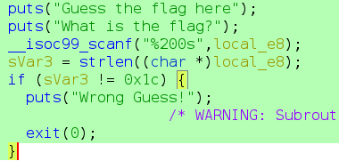
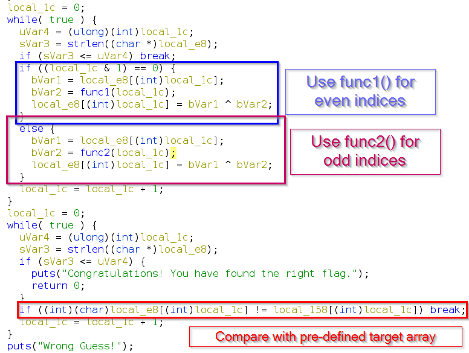
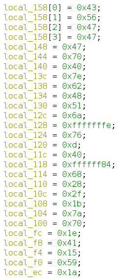

# flaghunt 2022 (Qualifier) - Math Is Fun Writeup

# About the Challenge
This challenge was part of **flaghunt 2022 Qualifier round**, which is a nationwide CTF organized by CTF Community BD. Its basically a `rev` challenge with moderate difficulty. Points for the challenge was 250.

`Category: rev`

[Challenge Executable File](https://github.com/peace-ranger/CTF-WriteUps/blob/main/2022/flaghunt/qualifier/Math%20Is%20Fun/math)

# TL;DR
The challenge implements two functions that does some math operations on our input string, modifies it and compares the modified input with an array of pre-defined values. At first, like similar `rev` challenges, i thought i needed to reverse the math functions or brute force with all printable characters (A-Za-z0-9^{}.....) to match with the target values. But after careful observation of the disassembled code, i noticed that i can just `xor` the output of the functions with the target values to get the flag.

The solution code can be found [here](#solution-code).

# Walkthrough
## Understanding the problem
As with any challenge, lets first see what the program does when run. Following we can see that it just asks for a guess for the flag and given a random guess it prints `Wrong Guess!` and then exits.
```bash
$ ./math
Guess the flag here
What is the flag?
aaaa
Wrong Guess!
```
Now lets get into the heart of the problem by looking at the disassembled code inside [Ghidra](https://ghidra-sre.org/).



The part of the disassembly in the above figure shows that after printing the prompts, an input is taken and checked whether the length of the input string equals `0x1c (28)`. So, we have to provide a 28 character long input and from this it can be deduced that the length of the flag would be **`28`**. Now, lets look at the rest of the disassembly.



I've marked the interesting parts of the code in the above figure. Its clearly visible that the input characters are being modified. One character of the input array is being used in each iteration. When the current index is an **even** number, in the *blue marked region*, its passed into `func1()` and the result is then `xor`'ed with the current input character. Afterwards, the result of `xor` replaces the current character in the input array. On the other hand, for an **odd** index (*purple marked region*), `func2()` is called with the index as argument and the result is `xor`'ed with current input char which then gets stored in the input array.

Then, in the last `while` block, the modified input array (`local_e8`) is being compared against a pre-defined target array (`local_158`). The comparison is done character by character. If any character doesn't match then the loop immediately breaks and the program exits by showing the message `Wrong Guess`. That means to get to a certain character of the flag, all the preceding characters must be matched correctly. Now that its clear what the problem actually does, lets see in the next section how it can be solved. Before that, for completeness, the `func1()` and `func2()` functions are shown in the following two figures.

.png)

.png)

## Solution
To implement the solution, i made use of an useful property of `xor`. The property is if `a xor b` equals `c` then by xoring `c` with any of the input values (either `a` or `b`), we'll get the other input i.e. `c xor a = b` or `c xor b = a`.

If we look at what the program does, it basically `xor`'s two numbers and then compares it with a third number. That means the `xor` of two numbers must equal the third number. In our case, the two numbers being `xor`'ed are the output of the function and the input character. The third number is a value from the target array. The summarized calculation is something like the following:
```python
func1(i) ^ input_arr[i] == target_char[i] # for even index i
func2(i) ^ input_arr[i] == target_char[i] # for odd index i
```
As the function implementations are already known, we can have the values of the function calls `func1(i)` and `func2(i)`. The `target_array` is also known. Its hardcoded in the program as can be seen in the following figure:



So, we know two values of the `xor` operation, then by using the above mentioned `xor` property, we can find out the remaining value i.e. the `input_arr[i]`. One interesting thing to note here is that, to solve the challenge, we dont even have to understand what the two functions are doing. We can just consider these as black box and solve the challenge.

Now that we know what we have to do, its time to code our solution. At first i rewrote the function implementations in python and copied the target_array values.
```python
target_array = [0x43, 0x56, 0x47, 0x47, 0x47, 0x70, 0x40, 0x7e, 0x62, 0x48, 0x51, 0x6a, 0xfe, 0x76, 0x0d, 0x40, 0x84, 0x68, 0x28, 0x2f, 0x1b, 0x7a, 0x70, 0x1e, 0x41, 0x15, 0x59, 0x1a]

def func1(a):
    if (1 < a):
        ivar1 = func1(a - 1)
        a = func1(a - 2)
        a = a + ivar1
    return a

def func2(b):
    local_c = 0
    local_18 = 1
    while b != local_c:
        bVar1 = False
        local_18 += 1
        local_10 = 2
        while local_10 <= local_18 // 2:
            if local_18 % local_10 == 0:
                bVar1 = True
            local_10 += 1
        if not bVar1:
            local_c += 1
    return local_18
```
Next, I'd iterate from 1 to 28 (length of the flag) and in each iteration I passed the current index into the functions (`func1()` and `func2()`) based on whether the index was odd or even. Then I just `xor`'ed the return value that i got from the function with the corresponding value in `target_array`. By putting the `xor`'ed result in a variable, I got my coveted flag!
```python
flag = []
for i in range(28):
    if i % 2 == 0:
        xored_result =  (func1(i) & 0xff) ^ target_array[i]   
        flag.append(chr(xored_result))               
    else:
        xored_result =  (func2(i) & 0xff) ^ target_array[i]   
        flag.append(chr(xored_result))

print("".join(flag))
```
Just one thing to note here is that, I `AND`ed the output from the function with `0xff`. This just extracts the Least Significant Byte (LSB) of the output because we're dealing with characters here which are always 1 byte and the `xor` should be done with only the LSB.

# Solution Code

```python
#!/usr/bin/env python3

target_array = [0x43, 0x56, 0x47, 0x47, 0x47, 0x70, 0x40, 0x7e, 0x62, 0x48, 0x51, 0x6a, 0xfe, 0x76, 0x0d, 0x40, 0x84, 0x68, 0x28, 0x2f, 0x1b, 0x7a, 0x70, 0x1e, 0x41, 0x15, 0x59, 0x1a]

def func1(a):
    if (1 < a):
        ivar1 = func1(a - 1)
        a = func1(a - 2)
        a = a + ivar1
    return a

def func2(b):
    local_c = 0
    local_18 = 1
    while b != local_c:
        bVar1 = False
        local_18 += 1
        local_10 = 2
        while local_10 <= local_18 // 2:
            if local_18 % local_10 == 0:
                bVar1 = True
            local_10 += 1
        if not bVar1:
            local_c += 1
    return local_18

flag = []
for i in range(28):
    if i % 2 == 0:
        xored_result =  (func1(i) & 0xff) ^ target_array[i]   
        flag.append(chr(xored_result))               
    else:
        xored_result =  (func2(i) & 0xff) ^ target_array[i]   
        flag.append(chr(xored_result))

print("".join(flag))
```

## Flag
`CTFBD{How_fun_to_S0lv3_Math}`
