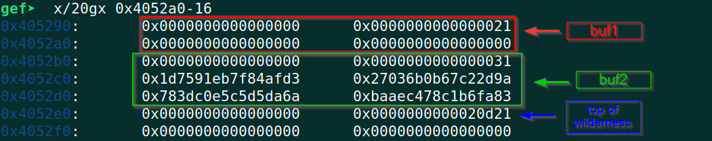
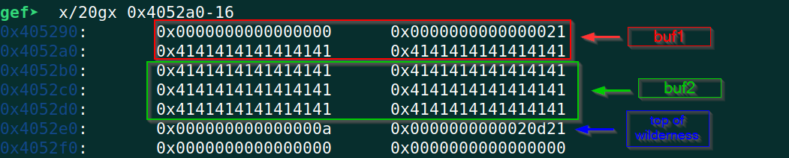
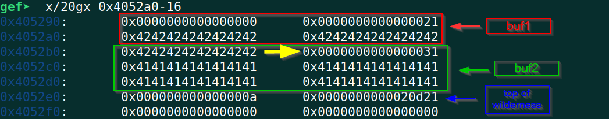

# angstrom CTF 2023 - LEEK Writeup

# Challenge Description
```
nc challs.actf.co 31310

Author: JoshDaBosh
Category: pwn
```
Challenge Files: [leek](https://files.actf.co/b20d5736209abff6ebef09037cdb7f1246fb801d77812548bf5c8bad1e187c32/leek) [Dockerfile](https://files.actf.co/0f0fce458ef02436967d01607e79984e3464534207d004dd8c87e824d51477f4/Dockerfile)

[solve.py](./solve.py)

# TL;DR
The challenge involves exploiting a heap overflow vulnerability. Two heap buffers (`buf1`, `buf2`) are allocated through `malloc()` and I am allowed to input more than the allocated size to the first buffer `buf1`. Some random bytes are stored in the second buffer `buf2`. I am asked to guess what are the contents of `buf2`. If I can tell then I'm allowed to write some arbitrary data to `buf1` through `gets()`. After that, `free()` is called on the two buffers and the next round starts where everything is repeated again. I have to guess the contents of `buf2` correctly for  100 times while maintaining the integrity of heap metadata and then the `flag.txt` file will be read, otherwise the program will exit.

The heap overflow in `buf1` allows us to overwrite the memory allocated for `buf2` also. So by overwriting `buf2` with some fixed value, I can easily tell what are its contents when I'm asked. But then I need to fix the overwritten metadata before the calls to `free()` as these are now some garbage values due to my overwrite. I use the `gets()` call to fix that and then `free()` executes properly and I move on to next iteration where I repeat the same for 100 times and get the [flag](#flag).

# Detailed Solution
When run, the program asks for a input, prints back the input, then askes for a secret and prints `Wrong!` if the secret is not correct.
```bash
$ ./leek 
I dare you to leek my secret.
Your input (NO STACK BUFFER OVERFLOWS!!): AAAA
:skull::skull::skull: bro really said: AAAA

So? What's my secret? AAAA
Wrong!
```
It says here `NO STACK BUFFER OVERFLOWS!!` which is kinda a hint that we are dealing with a heap overflow here.

Now its time to open the binary in Ghidra and look at the decompiled code. Following is the `main()` function of the binary (only relevant portion is shown):
```C
void main(void)
{
  local_10 = *(long *)(in_FS_OFFSET + 0x28);
  tVar2 = time((time_t *)0x0);
  srand((uint)tVar2);
  setbuf(stdout,(char *)0x0);
  setbuf(stdin,(char *)0x0);
  __rgid = getegid();
  setresgid(__rgid,__rgid,__rgid);
  puts("I dare you to leek my secret.");
  local_58 = 0;
  while( true ) {
    if (99 < local_58) {
      puts("Looks like you made it through.");
      win();
      if (local_10 != *(long *)(in_FS_OFFSET + 0x28)) {
                    /* WARNING: Subroutine does not return */
        __stack_chk_fail();
      }
      return;
    }
    buf1 = (char *)malloc(0x10);
    buf2 = (char *)malloc(0x20);
    memset(buf2,0,0x20);
    getrandom(buf2,0x20,0);
    for (local_54 = 0; local_54 < 0x20; local_54 = local_54 + 1) {
      if ((buf2[local_54] == '\0') || (buf2[local_54] == '\n')) {
        buf2[local_54] = '\x01';
      }
    }
    printf("Your input (NO STACK BUFFER OVERFLOWS!!): ");
    input(buf1);
    printf(":skull::skull::skull: bro really said: ");
    puts(buf1);
    printf("So? What\'s my secret? ");
    fgets(local_38,0x21,stdin);
    iVar1 = strncmp(buf2,local_38,0x20);
    if (iVar1 != 0) break;
    puts("Okay, I\'ll give you a reward for guessing it.");
    printf("Say what you want: ");
    gets(buf1);
    puts("Hmm... I changed my mind.");
    free(buf2);
    free(buf1);
    puts("Next round!");
    local_58 = local_58 + 1;
  }
  puts("Wrong!");
                    /* WARNING: Subroutine does not return */
  exit(-1);
}
```
Our goal here is to call `win()` by passing the check in line 13 which would in turn print the flag for us.
```C
void win(void)
{
  // Redacted
  
  local_10 = *(long *)(in_FS_OFFSET + 0x28);
  __stream = fopen("flag.txt","r");
  if (__stream == (FILE *)0x0) {
    puts("Error: missing flag.txt.");
                    /* WARNING: Subroutine does not return */
    exit(1);
  }
  fgets(local_98,0x80,__stream);
  puts(local_98);
  
  // Redacted
  return;
}
```
As we can see in the following, two buffers of size `0x10` and `0x20` is being `malloc()`'ed after which `buf2` is populated with random bytes. Then if the random bytes contain `'\0'` or `'\n'`, these are replaced with `'\x01'`.
```C
buf1 = (char *)malloc(0x10);
buf2 = (char *)malloc(0x20);
memset(buf2,0,0x20);
getrandom(buf2,0x20,0);
for (local_54 = 0; local_54 < 0x20; local_54 = local_54 + 1) {
  if ((buf2[local_54] == '\0') || (buf2[local_54] == '\n')) {
	buf2[local_54] = '\x01';
  }
}
```
Next, `buf1` is passed to `input()` function to take input. This is where the heap overflow vulnerability lies. The `input()` function is following:
```C
void input(void *buf1)
{
  // Redacted
  
  fgets(local_518,0x500,stdin);
  __n = strlen(local_518);
  memcpy(buf1,local_518,__n);
  
  // Redacted
  return;

```
`buf1` is a pointer to a memory in heap which was allocated 10 bytes in `main()`. But in `input()` function, an input of 0x500 bytes is being taken and then its copied to `buf1` through `memcpy()` in line no 8. Storing more than the allocated space is what results in heap overflow allowing us to overwrite memory allocated for other variables which in this program is the space for `buf2`.
If we take a look at GDB before the call to `input()` but after `buf2` is populated with random bytes then it looks like following:


Some extra space than requested are there in `malloc()` allocated chunks. When `malloc()` is called with a size parameter `n` then the actual allocated size is `size = roundup(n + metada_prefix_size, alignment_prefix)`. For future allocation and heap space maintenance, `malloc()` stores some metadata with each allocated chunk. For 64-bit systems, the size of this metadata is 16 bytes. Each allocated block must be aligned on a 16 or 32-byte boundary which is the `alignment_prefix` in the formula. For more details on malloc(), see [IBM's Documentation](https://www.ibm.com/docs/en/aix/7.1?topic=concepts-system-memory-allocation-using-malloc-subsystem). 

One component of metadata is the allocated chunk's size which is `0x21` for `buf1` and `0x31` for `buf2`. Here, the last bit of this size is `PREV_IN_USE` bit which indicates whether the previous block is allocated or not. This is why the sizes are `0x21` and `0x31` instead of `0x20` and `0x30` respectively.

Our goal here would be to overflow the `buf1` and write into `buf2` so that when we are asked what's inside `buf2` (line 35-37 in `main()`), we can say it for certain as we know what we wrote there. After overflowing `buf1` with 64 `A`'s (16 for `buf1`, 48 for `buf2`), the heap looks like following in GDB:


As expected, `buf2` now has all A's due to our overflow. Now we can pass the check in line no 38  by sending 32 `A`'s (`buf2`'s size is 32) and we are now allowed to input anything we want in `buf1` through the `gets()` function.
```C
if (iVar1 != 0) break;
puts("Okay, I\'ll give you a reward for guessing it.");
printf("Say what you want: ");
gets(buf1);
puts("Hmm... I changed my mind.");
free(buf2);
free(buf1);
puts("Next round!");
local_58 = local_58 + 1;
```
Now, this is where we need to get creative. We cant just input whatever we want cz then the program will crash whenever `free()` is called. `free()` relies on `malloc()` metadata like size, prev_in_use_bit etc for its proper execution cz these are used to maintain the freelist. But in the process of overflowing, we've corrupted heap metadata of `buf2`variable which would crash the program. How to restore the heap metadata so that `free()` executes properly and we go to next round? 

Simple! Use `gets()` to again overflow `buf1` but this time write some meaningful metadata into `buf2`. Now what can we write into `buf2`'s metadata portion? We can just write whatever was there earlier i.e. the size `0x0000000000000031`. We write some `B`'s and the size. The heap looks like following after this:


Now, the call to `free()` executes properly. These steps are repeated 100 times after which the condition in line no 13 becomes true,  `win()` is called and we get the [flag](#flag).

One caveat here was that, I was getting timeout around ~50 iterations because the timeout was set low in challenge server. I had to spawn a server in New York through Digital Ocean and then I got the flag. But honestly, in my opinion, a solution should not depend on the proximity of the server. Nevertheless, this was a fun and creative challenge.

## Flag
`actf{very_133k_of_y0u_777522a2c32b7dd6}`
