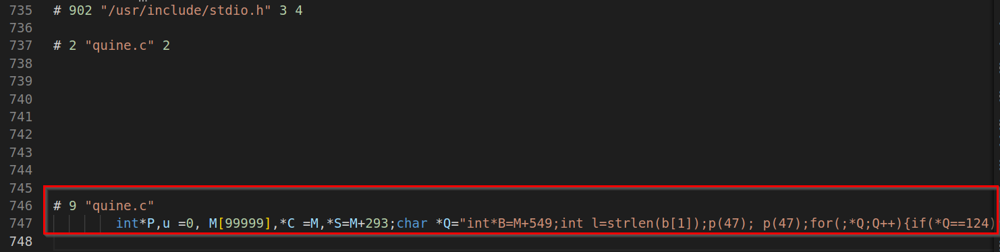
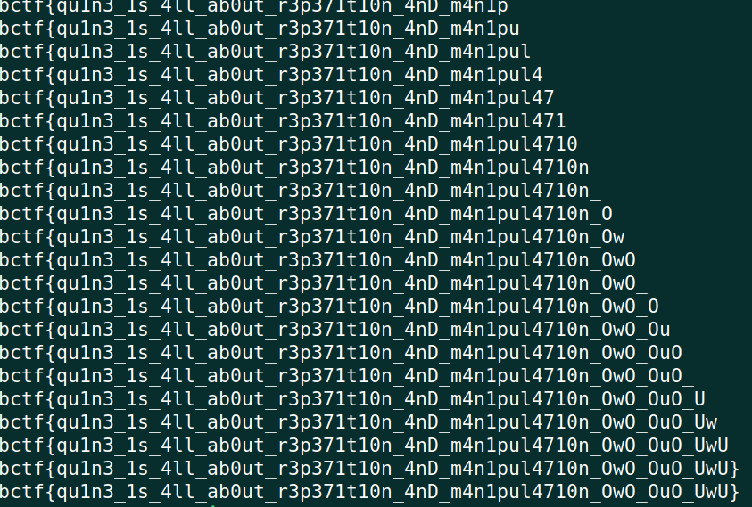

# b01lers CTF 2023 - PADLOCK Writeup

# Challenge Description
```
Mindblown by ioccc? How can someone write programs like this... Anyway, try open this padlock :)

Author: bronson113

Category: rev
```
[Challenge File - quine.c](https://ctf.b01lers.com/download?file_key=80f3300d2cc95f143b6eca63ca4f0757626a85c7f8005b3dd36616c07d69d76f&team_key=66b5d951acac088cb2b9105a6db0d6f41907adc4b07b1177b90c0fc94cd33f0e)

[solve.py](./solve.py)

# Solution
Was given a source code of obfuscated [quine](https://en.wikipedia.org/wiki/Quine_(computing)) program in c. 
```C
              #include/*firt*/<stdio.h>
           #define/*ah*/      p/**/putchar
         #define/*??*/         c/*cal*/char
        #define/*to*/           Q(q)int*P,u\
        /*why...*/=0,           M[99999],*C\
        =M,*S=M+293;c           *Q=#q/*am*/\
        ,H[99999],*D=           H;/*i*/int(\
        main)(int*a,c           **b){q;}/**/
/*quine*/Q(int*B=M+549;int/*ahhh*/l=strlen(b[1]);p(47);
p(47);for(;*Q;Q++){if(*Q==124)*C++=10;else/*haaa*/if(*Q
==126)*C++=32;else/*wtf_is_this*/if(*Q==33)*C++=34;else
/*woeira*/if(*Q>34)*C++=*Q;*D++=*Q==32?'\n':*Q;}for(int
u=-0;u<l*4;)p(-b[1][u/4]+S[u++]-S[u++]+(S[u++]^S[u++])?
88:79);p(10);/*weird___*/for(int*d=B;d<M+1280;)p(*d++);
printf("%s)",/*progra*/H+304);return/*UwU*/0**"^O{(u4X"
"z}e(tiIh.p+}Kj<&eb]0@sHecW^[.xroBCW=N3nG+r.]rGEs.UJw^"
"y'tn_Qv(y;Ed')#@q@xI1N:wH<X1aT)NtMvNlcY0;+x[cQ4j9>Qi2"
"#Yq&fR#os=ELTjS^/deJZ;EuY`#IQwKL)w<N<Zh,;W9X=&t0zX&E0"
"e<_3SVaLs(pXk6z-XGHTx8T/?-^`h[K0h}`dD6kX:vEeC,mI5fR9k"
"]{;yfO0Wg/1-Z^=WyUqN5XY1g25K1sJgKzfG.~~~~~~~~~~~~~~#i"
"nclude/*firt*/<stdio.h>|~~~~~~~~~~~#define/*ah*/~~~~~"
"~p/**/putchar|~~~~~~~~~#define/*??*/~~~~~~~~~c/*cal*/"
"char|~~~~~~~~#define/*to*/~~~~~~~~~~~Q(q)int*P,u\|~~~"
"~~~~~/*why...*/=0,~~~~~~~~~~~M[99999],*C\|~~~~~~~~=M,"
"*S=M+293;c~~~~~~~~~~~*Q=#q/*am*/\|~~~~~~~~,H[99999],*"
"D=~~~~~~~~~~~H;/*i*/int(\|~~~~~~~~main)(int*a,c~~~~~~"
"~~~~~**b){q;}/**/|/*quine*/Q(int*B=M+549;int/*ahhh*/l"
"=strlen(b[1]);p(47);|p(47);for(;*Q;Q++){if(*Q==124)*C"
"++=10;else/*haaa*/if(*Q|==126)*C++=32;else/*wtf_is_th"
"is*/if(*Q==33)*C++=34;else|/*woeira*/if(*Q>34)*C++=*Q"
";*D++=*Q==32?'\n':*Q;}for(int|u=-0;u<l*4;)p(-b[1][u/4"
"]+S[u++]-S[u++]+(S[u++]^S[u++])?|88:79);p(10);/*weird"
"___*/for(int*d=B;d<M+1280;)p(*d++);|printf(!%s)!,/*pr"
"ogra*/H+304);return/*UwU*//*quine*/Q(/*random_stuf*/")
```
The view of the program was quite amusing, the code was formatted like a padlock something like what people do in [iocc](https://en.wikipedia.org/wiki/International_Obfuscated_C_Code_Contest).
Lots of `#define` macros and obscure C syntax. Had to process the macros with `gcc -E quine.c` to get a somewhat readable format of the source code. Found the code at the very last of the processed file.



Saved and formatted the code which gave me a better understandable source code. 

```C
int *P, u = 0, M[99999], *C = M, *S = M + 293;
char *Q = "int*B=M+549;int l=strlen(b[1]);p(47); p(47);for(;*Q;Q++){if(*Q==124)*C++=10;else if(*Q ==126)*C++=32;else if(*Q==33)*C++=34;else if(*Q>34)*C++=*Q;*D++=*Q==32?'\\n':*Q;}for(int u=-0;u<l*4;)p(-b[1][u/4]+S[u++]-S[u++]+(S[u++]^S[u++])? 88:79);p(10); for(int*d=B;d<M+1280;)p(*d++); printf(\"%s)\", H+304);return 0**\"^O{(u4X\" \"z}e(tiIh.p+}Kj<&eb]0@sHecW^[.xroBCW=N3nG+r.]rGEs.UJw^\" \"y'tn_Qv(y;Ed')#@q@xI1N:wH<X1aT)NtMvNlcY0;+x[cQ4j9>Qi2\" \"#Yq&fR#os=ELTjS^/deJZ;EuY`#IQwKL)w<N<Zh,;W9X=&t0zX&E0\" \"e<_3SVaLs(pXk6z-XGHTx8T/?-^`h[K0h}`dD6kX:vEeC,mI5fR9k\" \"]{;yfO0Wg/1-Z^=WyUqN5XY1g25K1sJgKzfG.~~~~~~~~~~~~~~#i\" \"nclude/*firt*/<stdio.h>|~~~~~~~~~~~#define/*ah*/~~~~~\" \"~p/**/putchar|~~~~~~~~~#define/*??*/~~~~~~~~~c/*cal*/\" \"char|~~~~~~~~#define/*to*/~~~~~~~~~~~Q(q)int*P,u\\|~~~\" \"~~~~~/*why...*/=0,~~~~~~~~~~~M[99999],*C\\|~~~~~~~~=M,\" \"*S=M+293;c~~~~~~~~~~~*Q=#q/*am*/\\|~~~~~~~~,H[99999],*\" \"D=~~~~~~~~~~~H;/*i*/int(\\|~~~~~~~~main)(int*a,c~~~~~~\" \"~~~~~**b){q;}/**/|/*quine*/Q(int*B=M+549;int/*ahhh*/l\" \"=strlen(b[1]);p(47);|p(47);for(;*Q;Q++){if(*Q==124)*C\" \"++=10;else/*haaa*/if(*Q|==126)*C++=32;else/*wtf_is_th\" \"is*/if(*Q==33)*C++=34;else|/*woeira*/if(*Q>34)*C++=*Q\" \";*D++=*Q==32?'\\n':*Q;}for(int|u=-0;u<l*4;)p(-b[1][u/4\" \"]+S[u++]-S[u++]+(S[u++]^S[u++])?|88:79);p(10);/*weird\" \"___*/for(int*d=B;d<M+1280;)p(*d++);|printf(!%s)!,/*pr\" \"ogra*/H+304);return/*UwU*//*quine*/Q(/*random_stuf*/\"", H[99999], *D = H;
int(main)(int *a, char **b)
{
    int *B = M + 549;
    int l = strlen(b[1]);
    putchar(47);
    putchar(47);
    for (; *Q; Q++)
    {
        if (*Q == 124)
            *C++ = 10;
        else if (*Q == 126)
            *C++ = 32;
        else if (*Q == 33)
            *C++ = 34;
        else if (*Q > 34)
            *C++ = *Q;
        *D++ = *Q == 32 ? '\n' : *Q;
    }
    for (int u = -0; u < l * 4;)
        putchar(-b[1][u / 4] + S[u++] - S[u++] + (S[u++] ^ S[u++]) ? 88 : 79);
    putchar(10);
    for (int *d = B; d < M + 1280;)
        putchar(*d++);
    printf("%s)", H + 304);
    return 0 * *"^O{(u4X"
                "z}e(tiIh.p+}Kj<&eb]0@sHecW^[.xroBCW=N3nG+r.]rGEs.UJw^"
                "y'tn_Qv(y;Ed')#@q@xI1N:wH<X1aT)NtMvNlcY0;+x[cQ4j9>Qi2"
                "#Yq&fR#os=ELTjS^/deJZ;EuY`#IQwKL)w<N<Zh,;W9X=&t0zX&E0"
                "e<_3SVaLs(pXk6z-XGHTx8T/?-^`h[K0h}`dD6kX:vEeC,mI5fR9k"
                "]{;yfO0Wg/1-Z^=WyUqN5XY1g25K1sJgKzfG.~~~~~~~~~~~~~~#i"
                "nclude/*firt*/<stdio.h>|~~~~~~~~~~~#define/*ah*/~~~~~"
                "~p/**/putchar|~~~~~~~~~#define/*??*/~~~~~~~~~c/*cal*/"
                "char|~~~~~~~~#define/*to*/~~~~~~~~~~~Q(q)int*P,u\|~~~"
                "~~~~~/*why...*/=0,~~~~~~~~~~~M[99999],*C\|~~~~~~~~=M,"
                "*S=M+293;c~~~~~~~~~~~*Q=#q/*am*/\|~~~~~~~~,H[99999],*"
                "D=~~~~~~~~~~~H;/*i*/int(\|~~~~~~~~main)(int*a,c~~~~~~"
                "~~~~~**b){q;}/**/|/*quine*/Q(int*B=M+549;int/*ahhh*/l"
                "=strlen(b[1]);p(47);|p(47);for(;*Q;Q++){if(*Q==124)*C"
                "++=10;else/*haaa*/if(*Q|==126)*C++=32;else/*wtf_is_th"
                "is*/if(*Q==33)*C++=34;else|/*woeira*/if(*Q>34)*C++=*Q"
                ";*D++=*Q==32?'\n':*Q;}for(int|u=-0;u<l*4;)p(-b[1][u/4"
                "]+S[u++]-S[u++]+(S[u++]^S[u++])?|88:79);p(10);/*weird"
                "___*/for(int*d=B;d<M+1280;)p(*d++);|printf(!%s)!,/*pr"
                "ogra*/H+304);return/*UwU*//*quine*/Q(/*random_stuf*/";
}
```
Compiled and ran the source code which produced the source code itself, property of quine program. The main challenge was to figure out which part of the program was actually implementing the logic. I inserted some dummy printfs in between the main printing blocks to figure out which block was printing what and also removed everything after `return` as those were in fact the program itself. The resulting code was this:
```C
int *P, u = 0, M[99999], *C = M, *S = M + 293;
char *Q = "int*B=M+549;int l=strlen(b[1]);p(47); p(47);for(;*Q;Q++){if(*Q==124)*C++=10;else if(*Q ==126)*C++=32;else if(*Q==33)*C++=34;else if(*Q>34)*C++=*Q;*D++=*Q==32?'\\n':*Q;}for(int u=-0;u<l*4;)p(-b[1][u/4]+S[u++]-S[u++]+(S[u++]^S[u++])? 88:79);p(10); for(int*d=B;d<M+1280;)p(*d++); printf(\"%s)\", H+304);return 0**\"^O{(u4X\" \"z}e(tiIh.p+}Kj<&eb]0@sHecW^[.xroBCW=N3nG+r.]rGEs.UJw^\" \"y'tn_Qv(y;Ed')#@q@xI1N:wH<X1aT)NtMvNlcY0;+x[cQ4j9>Qi2\" \"#Yq&fR#os=ELTjS^/deJZ;EuY`#IQwKL)w<N<Zh,;W9X=&t0zX&E0\" \"e<_3SVaLs(pXk6z-XGHTx8T/?-^`h[K0h}`dD6kX:vEeC,mI5fR9k\" \"]{;yfO0Wg/1-Z^=WyUqN5XY1g25K1sJgKzfG.~~~~~~~~~~~~~~#i\" \"nclude/*firt*/<stdio.h>|~~~~~~~~~~~#define/*ah*/~~~~~\" \"~p/**/putchar|~~~~~~~~~#define/*??*/~~~~~~~~~c/*cal*/\" \"char|~~~~~~~~#define/*to*/~~~~~~~~~~~Q(q)int*P,u\\|~~~\" \"~~~~~/*why...*/=0,~~~~~~~~~~~M[99999],*C\\|~~~~~~~~=M,\" \"*S=M+293;c~~~~~~~~~~~*Q=#q/*am*/\\|~~~~~~~~,H[99999],*\" \"D=~~~~~~~~~~~H;/*i*/int(\\|~~~~~~~~main)(int*a,c~~~~~~\" \"~~~~~**b){q;}/**/|/*quine*/Q(int*B=M+549;int/*ahhh*/l\" \"=strlen(b[1]);p(47);|p(47);for(;*Q;Q++){if(*Q==124)*C\" \"++=10;else/*haaa*/if(*Q|==126)*C++=32;else/*wtf_is_th\" \"is*/if(*Q==33)*C++=34;else|/*woeira*/if(*Q>34)*C++=*Q\" \";*D++=*Q==32?'\\n':*Q;}for(int|u=-0;u<l*4;)p(-b[1][u/4\" \"]+S[u++]-S[u++]+(S[u++]^S[u++])?|88:79);p(10);/*weird\" \"___*/for(int*d=B;d<M+1280;)p(*d++);|printf(!%s)!,/*pr\" \"ogra*/H+304);return/*UwU*//*quine*/Q(/*random_stuf*/\"", H[99999], *D = H;
int(main)(int *a, char **b)
{
    int *B = M + 549;
    int l = strlen(b[1]);
    putchar(47);
    putchar(47);
    for (; *Q; Q++)
    {
        if (*Q == 124)
            *C++ = 10;
        else if (*Q == 126)
            *C++ = 32;
        else if (*Q == 33)
            *C++ = 34;
        else if (*Q > 34)
            *C++ = *Q;
        *D++ = *Q == 32 ? '\n' : *Q;
    }
    printf("\n--------------------------HELLO1-----------------------\n");
    for (int u = -0; u < l * 4;)
    {
        putchar(-b[1][u / 4] + S[u++] - S[u++] + (S[u++] ^ S[u++]) ? 88 : 79);
    }
    putchar(10);

    printf("\n--------------------------HELLO2-----------------------\n");
    for (int *d = B; d < M + 1280;)
        putchar(*d++);

    printf("\n--------------------------HELLO3-----------------------\n");
    printf("%s)", H + 304);
}
```
I noticed after `HELLO2` and `HELLO3`, the source code itself was being printed. Not interesting. What's interesting was that, after `HELLO1`, `X`'s were being printed `len(arg)` number of times where `arg` is the command line argument passed to the program. This sort of strike me as a clue that something is going on here.

From the name and description, it was clear that I had to provide an input which is basically the flag. I tried with some random guess input and for a really long input I saw that instead of printing `X`, it was printing `O`. This is when I understood the meaning of the following block of code:
```C
for (int u = -0; u < l * 4;)
{
    putchar(-b[1][u / 4] + S[u++] - S[u++] + (S[u++] ^ S[u++]) ? 88 : 79);
}
```
If I gave the correct character for a particular position, then I'd get an `O`, some status saying my input is correct. For wrong input, I'd get an `X`, indicating that my input character at that position is not part of the flag. From there it was clear what I had to do. I brute forced each character till I get a `}` cz that is the end of the flag. I modified the source to just print only either `X` or `O` so that I can run the program from inside my python script and just check whether I got an `X` or `O`. The final modified source is following:
```C
int *P, u = 0, M[99999], *C = M, *S = M + 293;
char *Q = "int*B=M+549;int l=strlen(b[1]);p(47); p(47);for(;*Q;Q++){if(*Q==124)*C++=10;else if(*Q ==126)*C++=32;else if(*Q==33)*C++=34;else if(*Q>34)*C++=*Q;*D++=*Q==32?'\\n':*Q;}for(int u=-0;u<l*4;)p(-b[1][u/4]+S[u++]-S[u++]+(S[u++]^S[u++])? 88:79);p(10); for(int*d=B;d<M+1280;)p(*d++); printf(\"%s)\", H+304);return 0**\"^O{(u4X\" \"z}e(tiIh.p+}Kj<&eb]0@sHecW^[.xroBCW=N3nG+r.]rGEs.UJw^\" \"y'tn_Qv(y;Ed')#@q@xI1N:wH<X1aT)NtMvNlcY0;+x[cQ4j9>Qi2\" \"#Yq&fR#os=ELTjS^/deJZ;EuY`#IQwKL)w<N<Zh,;W9X=&t0zX&E0\" \"e<_3SVaLs(pXk6z-XGHTx8T/?-^`h[K0h}`dD6kX:vEeC,mI5fR9k\" \"]{;yfO0Wg/1-Z^=WyUqN5XY1g25K1sJgKzfG.~~~~~~~~~~~~~~#i\" \"nclude/*firt*/<stdio.h>|~~~~~~~~~~~#define/*ah*/~~~~~\" \"~p/**/putchar|~~~~~~~~~#define/*??*/~~~~~~~~~c/*cal*/\" \"char|~~~~~~~~#define/*to*/~~~~~~~~~~~Q(q)int*P,u\\|~~~\" \"~~~~~/*why...*/=0,~~~~~~~~~~~M[99999],*C\\|~~~~~~~~=M,\" \"*S=M+293;c~~~~~~~~~~~*Q=#q/*am*/\\|~~~~~~~~,H[99999],*\" \"D=~~~~~~~~~~~H;/*i*/int(\\|~~~~~~~~main)(int*a,c~~~~~~\" \"~~~~~**b){q;}/**/|/*quine*/Q(int*B=M+549;int/*ahhh*/l\" \"=strlen(b[1]);p(47);|p(47);for(;*Q;Q++){if(*Q==124)*C\" \"++=10;else/*haaa*/if(*Q|==126)*C++=32;else/*wtf_is_th\" \"is*/if(*Q==33)*C++=34;else|/*woeira*/if(*Q>34)*C++=*Q\" \";*D++=*Q==32?'\\n':*Q;}for(int|u=-0;u<l*4;)p(-b[1][u/4\" \"]+S[u++]-S[u++]+(S[u++]^S[u++])?|88:79);p(10);/*weird\" \"___*/for(int*d=B;d<M+1280;)p(*d++);|printf(!%s)!,/*pr\" \"ogra*/H+304);return/*UwU*//*quine*/Q(/*random_stuf*/\"", H[99999], *D = H;
int(main)(int *a, char **b)
{
    int *B = M + 549;
    int l = strlen(b[1]);
    // putchar(47);
    // putchar(47);
    for (; *Q; Q++)
    {
        if (*Q == 124)
            *C++ = 10;
        else if (*Q == 126)
            *C++ = 32;
        else if (*Q == 33)
            *C++ = 34;
        else if (*Q > 34)
            *C++ = *Q;
        *D++ = *Q == 32 ? '\n' : *Q;
    }
    // printf("\n--------------------------HELLO1-----------------------\n");
    for (int u = -0; u < l * 4;)
    {
        putchar(-b[1][u / 4] + S[u++] - S[u++] + (S[u++] ^ S[u++]) ? 88 : 79);
    }
    putchar(10);
    // printf("\n--------------------------HELLO2-----------------------\n");
    // for (int *d = B; d < M + 1280;)
    //     putchar(*d++);
    // printf("\n--------------------------HELLO3-----------------------\n");
    // printf("%s)", H + 304);
}
```

## solve.py
```python
#!/usr/bin/env python3

import string
from pwn import *

context.log_level = 'error'

string = "0123456789abcdefghijklmnopqrstuvwxyzABCDEFGHIJKLMNOPQRSTUVWXYZ!#$%&'()*+\,-./:;<=>?@[\\]^_`{|}~"
flag = ""
correct_count = 1

elf = ELF("./random2")

while True:
    status_expected = correct_count * 'O'
    for c in string:
        p = process([elf.path, flag + c])
        status_got = p.recvall().decode().strip()
        
        # the program gives a status if a character in a particular position is correct
        # 'X' means WRONG, 'O' means CORRECT
        # for example, if 1st character is correct and 2nd charcter is wrong it'll output OX
        if status_got == status_expected:
            correct_count += 1
            flag = flag[:] + c
            print(flag)
            break
    
    # break if last character of the flag '}' is found
    if flag[len(flag) - 1] == '}':
        break
    
print(flag)
```

## Flag



```
bctf{qu1n3_1s_4ll_ab0ut_r3p371t10n_4nD_m4n1pul4710n_OwO_OuO_UwU}
```
