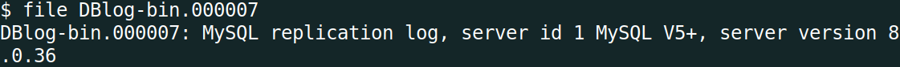
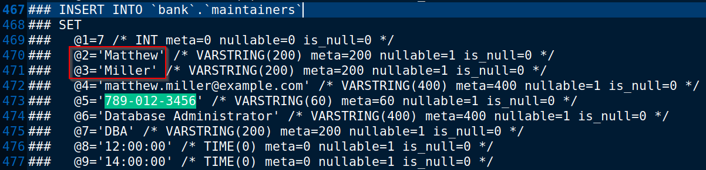
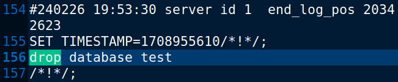
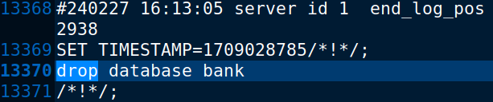
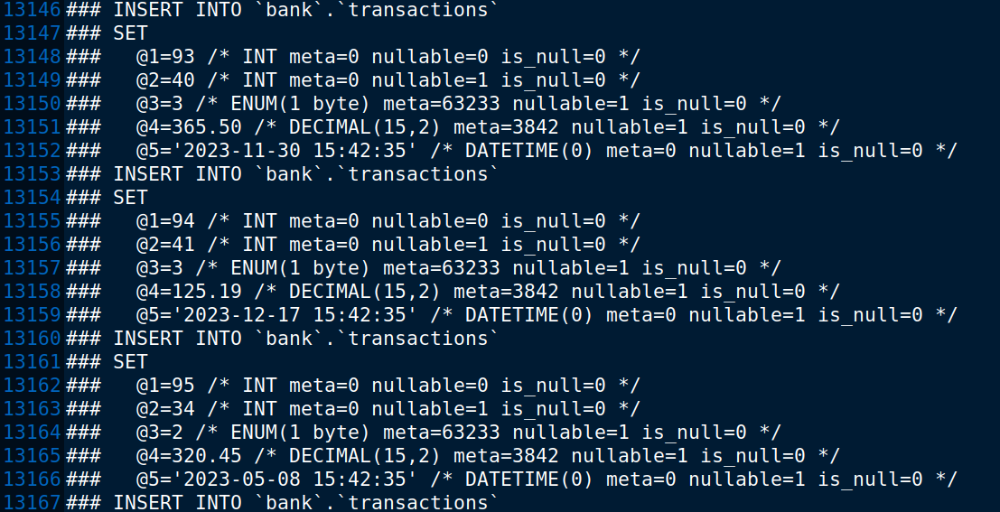
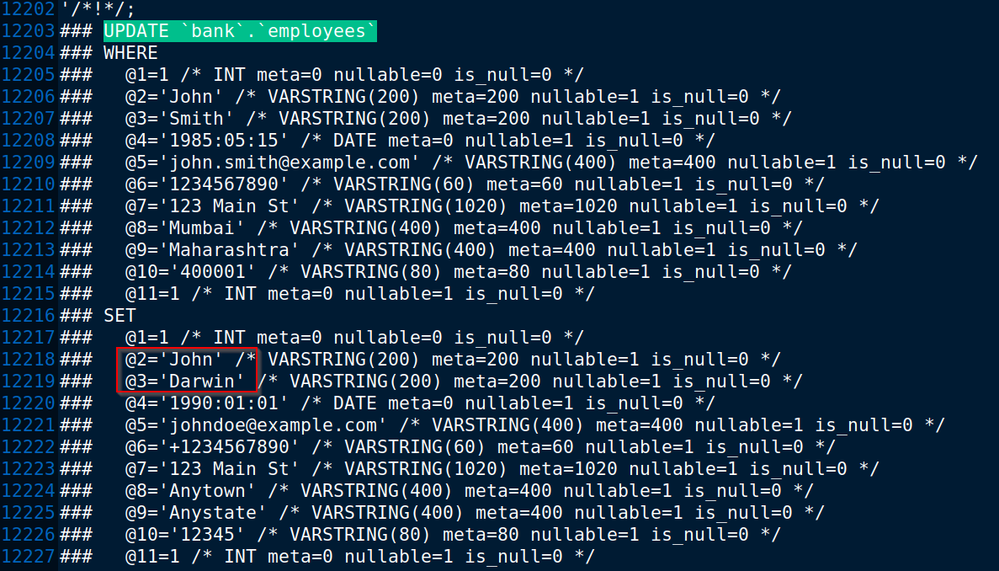
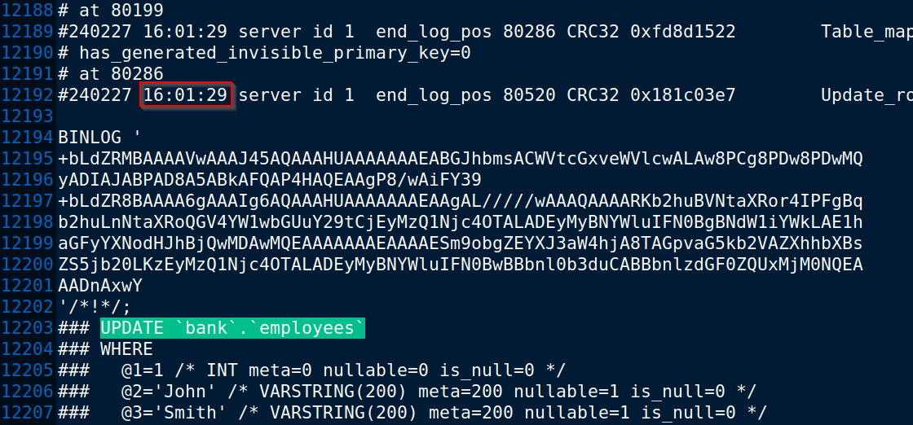

# Challenge Description
```
There was a major heist at the local bank. Initial findings suggest that an intruder from within the bank, specifically someone from the bank's database maintenance team, aided in the robbery. This traitor granted access to an outsider, who orchestrated the generation of fake transactions and the depletion of our valuable customers' accounts. We have the phone number, '789-012-3456', from which the login was detected, which manipulated the bank's employee data. Additionally, it's noteworthy that this intruder attempted to add gibberish to the binlog and ultimately dropped the entire database at the end of the heist.

Your task is to identify the first name of the traitor, the last name of the outsider, and the time at which the outsider was added to the database.

Author : Saksham Saipatwar
Flag format : VishwaCTF{TraitorFirstName_OutsiderLastName_HH:MM:SS}

Category: Digital Forensics
Pts: 286
```
# Solution
We were given a mysql replication log file as seen below:



After searching online, I found that the `mysqlbinlog` utility that comes with mysql server can be used to read the replication logs. From the documentation I found the following command which can be used to decode the binlog contents.
```
mysqlbinlog -vv DBlog-bin.000007
```
I saved the output in a file and started looking for answers. I started by searching the given phone number (`789-012-3456`) in the file and found 1 match which gave me the name of the Traitor.



As we can see from the image, the name of traitor is `Mathew Miller`.
Next I have to find the name of the outsider. One clue was that he dropped the table after the heist. So I searched for any `drop` command. While searching I found that the same set of SQL commands were repeated for a number of times. That means the outsider just copied the replication log a few times to make analysis difficult. But once I knew this it was easy for me to focus on the right part.
I found two unique `drop` commands, one dropping the `test` table and another `bank` table.





The `bank` database was of interest. So I figured I would search my way upwards from this `drop database bank` statement and see if there were any updates on employee database. I thought about the logical flow here: the insider must have updated the employee database to add the outsider, then the outsider manipulated transactions database and later dropped the table. So if I start from this drop table statement, then I should see some fake transactions and then an update of employee database. Indeed this was the case.





As can be seen from the image, an update was made on the employee database. The user `John Smith` has been replaced with `John Darwin`. So `Darwin` is the last name of outsider. We can also see the time at which this update was made.



The time is `16:01:29`. But it didn't work when I submitted. Then I came to know that I had to convert the time to IST from my time. So I adjusted the time by 30 minutes and the correct time was `15:31:29`. This completes all part of the flag.
## Flag
`VishwaCTF{Matthew_Darwin_15:31:29}`
