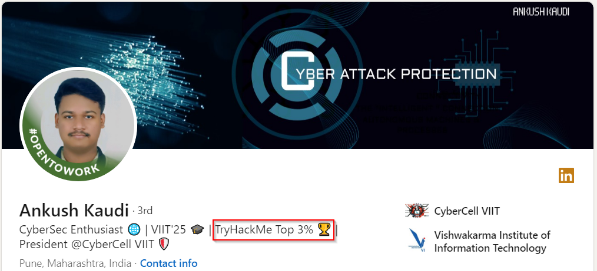
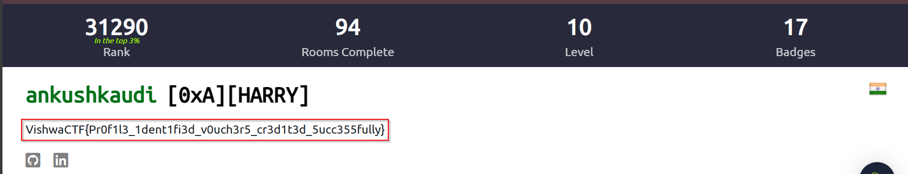

# Challenge Description
```
TryHackMe is a browser-based cyber security training platform, with learning content covering all skill levels from the complete beginner to the seasoned hacker.

One of our team member is very active on the platform. Recently, I got to know that he comes under 3% in the global leaderboard. Impressive isn't it.
Maybe you should have a look at his profile

PS : He keeps his digital identity very simple. No fancy usernames. It's just a simple mathematics
His real name == His username

Author : Amruta Patil
FLAG FORMAT: VishwaCTF{}

Category: osint
Pts: 300
```

# Solution
So the task is to find out one member of the CTF organizer team who is in the top 3% of global leaderboard in tryhackme. This seemed like a long chase first but it was the 3rd member from their core team. It was Ankush Kaudi, the president of CyberCell VIIT. In his linkedin profile that I got from the team page, he mentioned that he is "TryHackMe Top 3% 🏆" .



Then after some trial and error and utilizing the hint mentioned in challenge description, I found his tryhackme profile which was `https://tryhackme.com/p/ankushkaudi`. The flag was directly written in his profile.



## Flag
`VishwaCTF{Pr0f1l3_1dent1fi3d_v0uch3r5_cr3d1t3d_5ucc355fully}`
